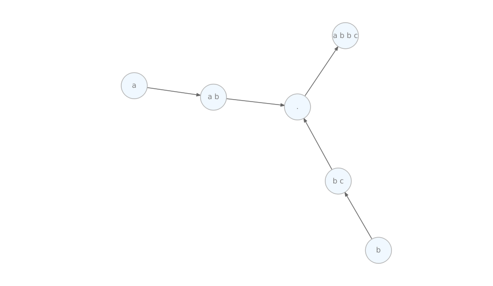
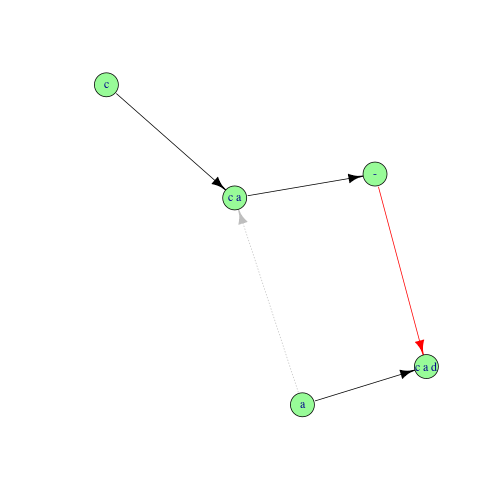
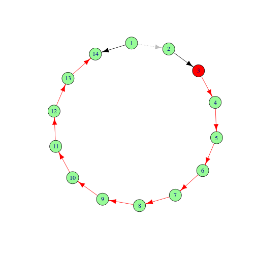

[](https://travis-ci.org/arendsee/rmonad)
[](https://codecov.io/github/arendsee/rmonad?branch=master)
[](https://cran.r-project.org/package=rmonad)
[](http://cran.rstudio.com/web/packages/rmonad/index.html)
[](http://cranlogs.r-pkg.org/badges/grand-total/rmonad)


# `rmonad`

Chain monadic sequences into stateful, branching pipelines. As nodes in the
pipeline are run, they are merged into a graph of all past operations. The
resulting structure can be computed on to access not only the final results,
but also node documentation, intermediate data, performance stats, and any raised
messages, warnings or errors. `rmonad` intercepts all exceptions, which allows
for pure error handling.

`rmond` complements, rather than competes with non-monadic pipelines packages
such as `magrittr` or `pipeR`. These can be used to perform operations where
preservation of state is not desired. Also they are needed to operate on
monadic containers themselves.

## Funding

This work is funded by the National Science Foundation grant:

[NSF-IOS 1546858](https://www.nsf.gov/awardsearch/showAward?AWD_ID=1546858)
Orphan Genes: An Untapped Genetic Reservoir of Novel Traits

## Installation

You can install from CRAN with:


```r
install.packages("rmonad")
```

The newest `rmonad` code will always be in the github `dev` branch.
You can install this with:


```r
devtools::install_github("arendsee/rmonad", ref="dev")
```

## Examples

For details, see the vignette. Here are a few excerpts


```r
library(rmonad)
```


### Record history and access inner values


```r
1:5      %>>%
    sqrt %v>% # record an intermediate value
    sqrt %>>%
    sqrt
#> An object of class "Rmonad"
#> Slot "graph":
#> IGRAPH 379c140 DN-- 4 3 -- 
#> + attr: name (v/c), type (e/c)
#> + edges from 379c140 (vertex names):
#> [1] 912d8d22-13e3-4000-938e-04986fc15cb9->d22e70ef-9ab5-4413-b00c-7d9d02c0eb08
#> [2] d22e70ef-9ab5-4413-b00c-7d9d02c0eb08->7e29b373-d69a-4083-b5ba-4318ee21d4e5
#> [3] 7e29b373-d69a-4083-b5ba-4318ee21d4e5->5755b5e4-fa7c-4222-8121-9a049c53e7b1
#> 
#> Slot "head":
#> [1] "5755b5e4-fa7c-4222-8121-9a049c53e7b1"
#> 
#> Slot "data":
#> $`912d8d22-13e3-4000-938e-04986fc15cb9`
#> An object of class "RmonadData"
#> Slot "value":
#> An object of class "CacheManager"
#> Slot "get":
#> function (warn = TRUE) 
#> {
#>     if (warn) {
#>         warning("Attempting to access data that has been deleted, returning 'NULL'")
#>     }
#>     NULL
#> }
#> <environment: 0x55deef3a1e70>
#> 
#> Slot "del":
#> function (...) 
#> {
#>     invisible()
#> }
#> <environment: namespace:rmonad>
#> 
#> Slot "chk":
#> function (...) 
#> {
#>     FALSE
#> }
#> <environment: namespace:rmonad>
#> 
#> 
#> Slot "code":
#> [1] "1:5"
#> 
#> Slot "error":
#> character(0)
#> 
#> Slot "warnings":
#> character(0)
#> 
#> Slot "notes":
#> character(0)
#> 
#> Slot "OK":
#> [1] TRUE
#> 
#> Slot "doc":
#> character(0)
#> 
#> Slot "mem":
#> [1] 72
#> 
#> Slot "time":
#> [1] 0
#> 
#> Slot "meta":
#> list()
#> 
#> Slot "summary":
#> list()
#> 
#> Slot "nest_depth":
#> [1] 1
#> 
#> Slot "stored":
#> [1] FALSE
#> 
#> Slot "options":
#> $keep_grey
#> [1] FALSE
#> 
#> 
#> 
#> $`d22e70ef-9ab5-4413-b00c-7d9d02c0eb08`
#> An object of class "RmonadData"
#> Slot "value":
#> An object of class "CacheManager"
#> Slot "get":
#> function (...) 
#> x
#> <environment: 0x55deeedb3d48>
#> 
#> Slot "del":
#> function (...) 
#> {
#>     invisible()
#> }
#> <environment: namespace:rmonad>
#> 
#> Slot "chk":
#> function (...) 
#> {
#>     TRUE
#> }
#> <environment: namespace:rmonad>
#> 
#> 
#> Slot "code":
#> [1] "sqrt"
#> 
#> Slot "error":
#> character(0)
#> 
#> Slot "warnings":
#> character(0)
#> 
#> Slot "notes":
#> character(0)
#> 
#> Slot "OK":
#> [1] TRUE
#> 
#> Slot "doc":
#> character(0)
#> 
#> Slot "mem":
#> [1] 88
#> 
#> Slot "time":
#> [1] 0.053
#> 
#> Slot "meta":
#> list()
#> 
#> Slot "summary":
#> list()
#> 
#> Slot "nest_depth":
#> [1] 1
#> 
#> Slot "stored":
#> [1] TRUE
#> 
#> Slot "options":
#> $keep_grey
#> [1] FALSE
#> 
#> 
#> 
#> $`7e29b373-d69a-4083-b5ba-4318ee21d4e5`
#> An object of class "RmonadData"
#> Slot "value":
#> An object of class "CacheManager"
#> Slot "get":
#> function (warn = TRUE) 
#> {
#>     if (warn) {
#>         warning("Attempting to access data that has been deleted, returning 'NULL'")
#>     }
#>     NULL
#> }
#> <environment: 0x55deeee36498>
#> 
#> Slot "del":
#> function (...) 
#> {
#>     invisible()
#> }
#> <environment: namespace:rmonad>
#> 
#> Slot "chk":
#> function (...) 
#> {
#>     FALSE
#> }
#> <environment: namespace:rmonad>
#> 
#> 
#> Slot "code":
#> [1] "sqrt"
#> 
#> Slot "error":
#> character(0)
#> 
#> Slot "warnings":
#> character(0)
#> 
#> Slot "notes":
#> character(0)
#> 
#> Slot "OK":
#> [1] TRUE
#> 
#> Slot "doc":
#> character(0)
#> 
#> Slot "mem":
#> [1] 88
#> 
#> Slot "time":
#> [1] 0.004
#> 
#> Slot "meta":
#> list()
#> 
#> Slot "summary":
#> list()
#> 
#> Slot "nest_depth":
#> [1] 1
#> 
#> Slot "stored":
#> [1] FALSE
#> 
#> Slot "options":
#> $keep_grey
#> [1] FALSE
#> 
#> 
#> 
#> $`5755b5e4-fa7c-4222-8121-9a049c53e7b1`
#> An object of class "RmonadData"
#> Slot "value":
#> An object of class "CacheManager"
#> Slot "get":
#> function (...) 
#> x
#> <environment: 0x55deef0ab760>
#> 
#> Slot "del":
#> function (...) 
#> {
#>     invisible()
#> }
#> <environment: namespace:rmonad>
#> 
#> Slot "chk":
#> function (...) 
#> {
#>     TRUE
#> }
#> <environment: namespace:rmonad>
#> 
#> 
#> Slot "code":
#> [1] "sqrt"
#> 
#> Slot "error":
#> character(0)
#> 
#> Slot "warnings":
#> character(0)
#> 
#> Slot "notes":
#> character(0)
#> 
#> Slot "OK":
#> [1] TRUE
#> 
#> Slot "doc":
#> character(0)
#> 
#> Slot "mem":
#> [1] 88
#> 
#> Slot "time":
#> [1] 0
#> 
#> Slot "meta":
#> list()
#> 
#> Slot "summary":
#> list()
#> 
#> Slot "nest_depth":
#> [1] 1
#> 
#> Slot "stored":
#> [1] FALSE
#> 
#> Slot "options":
#> $keep_grey
#> [1] FALSE
```


### Add effects inside a pipeline


```r
# Both plots and summarizes an input table
cars %>_% plot(xlab="index", ylab="value") %>>% summary
```


### Use first successful result


```r
x <- list()

# return first value in a list, otherwise return NULL
if(length(x) > 0) {
    x[[1]]
} else {
    NULL
}
#> NULL

# this does the same
x[[1]] %||% NULL %>% esc
#> NULL
```


### Independent evaluation of multiple expressions


```r
funnel(
    runif(5),
    stop("stop, drop and die"),
    runif("df"),
    1:10
)
#> An object of class "Rmonad"
#> Slot "graph":
#> IGRAPH a4c930c DN-- 5 4 -- 
#> + attr: name (v/c), type (e/c)
#> + edges from a4c930c (vertex names):
#> [1] ada4d3a2-541e-452f-8339-6f33dc7a63f7->4c1dbb2c-c28f-490a-8596-25fd1791e90f
#> [2] 37d62b87-c2fa-4887-9683-926020bb03ca->4c1dbb2c-c28f-490a-8596-25fd1791e90f
#> [3] 959322b4-c7b8-4157-9cab-b37ea3abee4a->4c1dbb2c-c28f-490a-8596-25fd1791e90f
#> [4] 7b99b122-5be4-4085-8731-22af0ff10ec2->4c1dbb2c-c28f-490a-8596-25fd1791e90f
#> 
#> Slot "head":
#> [1] "4c1dbb2c-c28f-490a-8596-25fd1791e90f"
#> 
#> Slot "data":
#> $`7b99b122-5be4-4085-8731-22af0ff10ec2`
#> An object of class "RmonadData"
#> Slot "value":
#> An object of class "CacheManager"
#> Slot "get":
#> function (warn = TRUE) 
#> {
#>     if (warn) {
#>         warning("Attempting to access data that has been deleted, returning 'NULL'")
#>     }
#>     NULL
#> }
#> <environment: 0x55deef20b138>
#> 
#> Slot "del":
#> function (...) 
#> {
#>     invisible()
#> }
#> <environment: namespace:rmonad>
#> 
#> Slot "chk":
#> function (...) 
#> {
#>     FALSE
#> }
#> <environment: namespace:rmonad>
#> 
#> 
#> Slot "code":
#> [1] "1:10"
#> 
#> Slot "error":
#> character(0)
#> 
#> Slot "warnings":
#> character(0)
#> 
#> Slot "notes":
#> character(0)
#> 
#> Slot "OK":
#> [1] TRUE
#> 
#> Slot "doc":
#> character(0)
#> 
#> Slot "mem":
#> [1] 88
#> 
#> Slot "time":
#> [1] 0
#> 
#> Slot "meta":
#> list()
#> 
#> Slot "summary":
#> list()
#> 
#> Slot "nest_depth":
#> [1] 1
#> 
#> Slot "stored":
#> [1] FALSE
#> 
#> Slot "options":
#> $keep_grey
#> [1] FALSE
#> 
#> 
#> 
#> $`959322b4-c7b8-4157-9cab-b37ea3abee4a`
#> An object of class "RmonadData"
#> Slot "value":
#> An object of class "CacheManager"
#> Slot "get":
#> function (warn = TRUE) 
#> {
#>     if (warn) {
#>         warning("Accessing node with no stored value, returning 'NULL'")
#>     }
#>     NULL
#> }
#> <environment: 0x55deefb91ab8>
#> 
#> Slot "del":
#> function (...) 
#> {
#>     invisible()
#> }
#> <environment: namespace:rmonad>
#> 
#> Slot "chk":
#> function (...) 
#> {
#>     FALSE
#> }
#> <environment: namespace:rmonad>
#> 
#> 
#> Slot "code":
#> [1] "runif(\"df\")"
#> 
#> Slot "error":
#> [1] "invalid arguments"
#> 
#> Slot "warnings":
#> [1] "NAs introduced by coercion"
#> 
#> Slot "notes":
#> character(0)
#> 
#> Slot "OK":
#> [1] FALSE
#> 
#> Slot "doc":
#> character(0)
#> 
#> Slot "mem":
#> [1] 48
#> 
#> Slot "time":
#> [1] 0
#> 
#> Slot "meta":
#> list()
#> 
#> Slot "summary":
#> list()
#> 
#> Slot "nest_depth":
#> [1] 1
#> 
#> Slot "stored":
#> [1] FALSE
#> 
#> Slot "options":
#> $keep_grey
#> [1] FALSE
#> 
#> 
#> 
#> $`37d62b87-c2fa-4887-9683-926020bb03ca`
#> An object of class "RmonadData"
#> Slot "value":
#> An object of class "CacheManager"
#> Slot "get":
#> function (warn = TRUE) 
#> {
#>     if (warn) {
#>         warning("Accessing node with no stored value, returning 'NULL'")
#>     }
#>     NULL
#> }
#> <environment: 0x55deefa7bf70>
#> 
#> Slot "del":
#> function (...) 
#> {
#>     invisible()
#> }
#> <environment: namespace:rmonad>
#> 
#> Slot "chk":
#> function (...) 
#> {
#>     FALSE
#> }
#> <environment: namespace:rmonad>
#> 
#> 
#> Slot "code":
#> [1] "stop(\"stop, drop and die\")"
#> 
#> Slot "error":
#> [1] "stop, drop and die"
#> 
#> Slot "warnings":
#> character(0)
#> 
#> Slot "notes":
#> character(0)
#> 
#> Slot "OK":
#> [1] FALSE
#> 
#> Slot "doc":
#> character(0)
#> 
#> Slot "mem":
#> [1] 48
#> 
#> Slot "time":
#> [1] 0.003
#> 
#> Slot "meta":
#> list()
#> 
#> Slot "summary":
#> list()
#> 
#> Slot "nest_depth":
#> [1] 1
#> 
#> Slot "stored":
#> [1] FALSE
#> 
#> Slot "options":
#> $keep_grey
#> [1] FALSE
#> 
#> 
#> 
#> $`ada4d3a2-541e-452f-8339-6f33dc7a63f7`
#> An object of class "RmonadData"
#> Slot "value":
#> An object of class "CacheManager"
#> Slot "get":
#> function (warn = TRUE) 
#> {
#>     if (warn) {
#>         warning("Attempting to access data that has been deleted, returning 'NULL'")
#>     }
#>     NULL
#> }
#> <environment: 0x55deef3ad358>
#> 
#> Slot "del":
#> function (...) 
#> {
#>     invisible()
#> }
#> <environment: namespace:rmonad>
#> 
#> Slot "chk":
#> function (...) 
#> {
#>     FALSE
#> }
#> <environment: namespace:rmonad>
#> 
#> 
#> Slot "code":
#> [1] "runif(5)"
#> 
#> Slot "error":
#> character(0)
#> 
#> Slot "warnings":
#> character(0)
#> 
#> Slot "notes":
#> character(0)
#> 
#> Slot "OK":
#> [1] TRUE
#> 
#> Slot "doc":
#> character(0)
#> 
#> Slot "mem":
#> [1] 88
#> 
#> Slot "time":
#> [1] 0
#> 
#> Slot "meta":
#> list()
#> 
#> Slot "summary":
#> list()
#> 
#> Slot "nest_depth":
#> [1] 1
#> 
#> Slot "stored":
#> [1] FALSE
#> 
#> Slot "options":
#> $keep_grey
#> [1] FALSE
#> 
#> 
#> 
#> $`4c1dbb2c-c28f-490a-8596-25fd1791e90f`
#> An object of class "RmonadData"
#> Slot "value":
#> An object of class "CacheManager"
#> Slot "get":
#> function (...) 
#> x
#> <environment: 0x55deef42fd68>
#> 
#> Slot "del":
#> function (...) 
#> {
#>     invisible()
#> }
#> <environment: namespace:rmonad>
#> 
#> Slot "chk":
#> function (...) 
#> {
#>     TRUE
#> }
#> <environment: namespace:rmonad>
#> 
#> 
#> Slot "code":
#> [1] "funnel(runif(5), stop(\"stop, drop and die\"), runif(\"df\"), 1:10)"
#> 
#> Slot "error":
#> character(0)
#> 
#> Slot "warnings":
#> character(0)
#> 
#> Slot "notes":
#> character(0)
#> 
#> Slot "OK":
#> [1] FALSE
#> 
#> Slot "doc":
#> character(0)
#> 
#> Slot "mem":
#> [1] 248
#> 
#> Slot "time":
#> [1] NA
#> 
#> Slot "meta":
#> list()
#> 
#> Slot "summary":
#> list()
#> 
#> Slot "nest_depth":
#> [1] 1
#> 
#> Slot "stored":
#> [1] FALSE
#> 
#> Slot "options":
#> $keep_grey
#> [1] FALSE
```


### Build branching pipelines


```r
funnel(
    read.csv("a.csv") %>>% do_analysis_a,
    read.csv("b.csv") %>>% do_analysis_b,
    k = 5
) %*>% joint_analysis
```


```r
foo <- {

  "This is nothing"

  NA

} %>>% {

  "This the length of nothing"

  length(.) 
}

bar <- {

  "These are cars"

  cars

} %>>% {

  "There are this many of them"

  length(.)
}


baz <- "oz" %>>%
  funnel(f=foo, b=bar) %*>%
  {

     "This definitely won't work"
     
     . + f + b
  }
```


### Chain independent pipelines, with documentation


```r
analysis <- 
{
    "This analysis begins with 5 uniform random variables"

    runif(5)

} %>>% '^'(2) %>>% sum %__%
{
    "The next step is to take 6 normal random variables"

    rnorm(6)  
} %>>% '^'(2) %>>% sum %__%
{
    "And this is were the magic happens, we take 'a' random normal variables"

    rnorm("a")

} %>>% '^'(2) %>>% sum %__%
{
    "Then, just for good measure, we toss in six exponentials"

    rexp(6)

} %>>% '^'(2) %>>% sum

analysis
#> An object of class "Rmonad"
#> Slot "graph":
#> IGRAPH 6220470 DN-- 10 9 -- 
#> + attr: name (v/c), type (e/c)
#> + edges from 6220470 (vertex names):
#> [1] 72f4060b-1f72-4464-8314-db16e18329b8->c1131376-1bd5-4710-9651-077ae88744a0
#> [2] c1131376-1bd5-4710-9651-077ae88744a0->84461caa-191d-4203-9e58-89cc7f9872b1
#> [3] 84461caa-191d-4203-9e58-89cc7f9872b1->67f315d8-caac-44c3-9abc-8e636fde97ac
#> [4] 67f315d8-caac-44c3-9abc-8e636fde97ac->55d9d9ea-2ba2-4378-ba4c-bf1f100c5327
#> [5] 55d9d9ea-2ba2-4378-ba4c-bf1f100c5327->ab2f6c9a-c576-445a-82c8-c901509d8496
#> [6] ab2f6c9a-c576-445a-82c8-c901509d8496->db512d3a-3a51-4408-a5a2-43187696e282
#> [7] db512d3a-3a51-4408-a5a2-43187696e282->953d7fa1-fc8f-4a0f-95e4-16cbfc575bd2
#> + ... omitted several edges
#> 
#> Slot "head":
#> [1] "d9e6501a-6f85-4bda-9f0c-02ca3cce81a8"
#> 
#> Slot "data":
#> $`72f4060b-1f72-4464-8314-db16e18329b8`
#> An object of class "RmonadData"
#> Slot "value":
#> An object of class "CacheManager"
#> Slot "get":
#> function (warn = TRUE) 
#> {
#>     if (warn) {
#>         warning("Attempting to access data that has been deleted, returning 'NULL'")
#>     }
#>     NULL
#> }
#> <environment: 0x55deef3c2d18>
#> 
#> Slot "del":
#> function (...) 
#> {
#>     invisible()
#> }
#> <environment: namespace:rmonad>
#> 
#> Slot "chk":
#> function (...) 
#> {
#>     FALSE
#> }
#> <environment: namespace:rmonad>
#> 
#> 
#> Slot "code":
#> [1] "{"            "    runif(5)" "}"           
#> 
#> Slot "error":
#> character(0)
#> 
#> Slot "warnings":
#> character(0)
#> 
#> Slot "notes":
#> character(0)
#> 
#> Slot "OK":
#> [1] TRUE
#> 
#> Slot "doc":
#> [1] "This analysis begins with 5 uniform random variables"
#> 
#> Slot "mem":
#> [1] 88
#> 
#> Slot "time":
#> [1] 0
#> 
#> Slot "meta":
#> list()
#> 
#> Slot "summary":
#> list()
#> 
#> Slot "nest_depth":
#> [1] 1
#> 
#> Slot "stored":
#> [1] FALSE
#> 
#> Slot "options":
#> $keep_grey
#> [1] FALSE
#> 
#> 
#> 
#> $`c1131376-1bd5-4710-9651-077ae88744a0`
#> An object of class "RmonadData"
#> Slot "value":
#> An object of class "CacheManager"
#> Slot "get":
#> function (warn = TRUE) 
#> {
#>     if (warn) {
#>         warning("Attempting to access data that has been deleted, returning 'NULL'")
#>     }
#>     NULL
#> }
#> <environment: 0x55deecf64ba0>
#> 
#> Slot "del":
#> function (...) 
#> {
#>     invisible()
#> }
#> <environment: namespace:rmonad>
#> 
#> Slot "chk":
#> function (...) 
#> {
#>     FALSE
#> }
#> <environment: namespace:rmonad>
#> 
#> 
#> Slot "code":
#> [1] "`^`(2)"
#> 
#> Slot "error":
#> character(0)
#> 
#> Slot "warnings":
#> character(0)
#> 
#> Slot "notes":
#> character(0)
#> 
#> Slot "OK":
#> [1] TRUE
#> 
#> Slot "doc":
#> character(0)
#> 
#> Slot "mem":
#> [1] 88
#> 
#> Slot "time":
#> [1] 0.003
#> 
#> Slot "meta":
#> list()
#> 
#> Slot "summary":
#> list()
#> 
#> Slot "nest_depth":
#> [1] 1
#> 
#> Slot "stored":
#> [1] FALSE
#> 
#> Slot "options":
#> $keep_grey
#> [1] FALSE
#> 
#> 
#> 
#> $`84461caa-191d-4203-9e58-89cc7f9872b1`
#> An object of class "RmonadData"
#> Slot "value":
#> An object of class "CacheManager"
#> Slot "get":
#> function (...) 
#> x
#> <environment: 0x55deedbeb0a0>
#> 
#> Slot "del":
#> function (...) 
#> {
#>     invisible()
#> }
#> <environment: namespace:rmonad>
#> 
#> Slot "chk":
#> function (...) 
#> {
#>     TRUE
#> }
#> <environment: namespace:rmonad>
#> 
#> 
#> Slot "code":
#> [1] "sum"
#> 
#> Slot "error":
#> character(0)
#> 
#> Slot "warnings":
#> character(0)
#> 
#> Slot "notes":
#> character(0)
#> 
#> Slot "OK":
#> [1] TRUE
#> 
#> Slot "doc":
#> character(0)
#> 
#> Slot "mem":
#> [1] 48
#> 
#> Slot "time":
#> [1] 0.003
#> 
#> Slot "meta":
#> list()
#> 
#> Slot "summary":
#> list()
#> 
#> Slot "nest_depth":
#> [1] 1
#> 
#> Slot "stored":
#> [1] TRUE
#> 
#> Slot "options":
#> $keep_grey
#> [1] FALSE
#> 
#> 
#> 
#> $`67f315d8-caac-44c3-9abc-8e636fde97ac`
#> An object of class "RmonadData"
#> Slot "value":
#> An object of class "CacheManager"
#> Slot "get":
#> function (warn = TRUE) 
#> {
#>     if (warn) {
#>         warning("Attempting to access data that has been deleted, returning 'NULL'")
#>     }
#>     NULL
#> }
#> <environment: 0x55deefc92540>
#> 
#> Slot "del":
#> function (...) 
#> {
#>     invisible()
#> }
#> <environment: namespace:rmonad>
#> 
#> Slot "chk":
#> function (...) 
#> {
#>     FALSE
#> }
#> <environment: namespace:rmonad>
#> 
#> 
#> Slot "code":
#> [1] "{"            "    rnorm(6)" "}"           
#> 
#> Slot "error":
#> character(0)
#> 
#> Slot "warnings":
#> character(0)
#> 
#> Slot "notes":
#> character(0)
#> 
#> Slot "OK":
#> [1] TRUE
#> 
#> Slot "doc":
#> [1] "The next step is to take 6 normal random variables"
#> 
#> Slot "mem":
#> [1] 88
#> 
#> Slot "time":
#> [1] 0
#> 
#> Slot "meta":
#> list()
#> 
#> Slot "summary":
#> list()
#> 
#> Slot "nest_depth":
#> [1] 1
#> 
#> Slot "stored":
#> [1] FALSE
#> 
#> Slot "options":
#> $keep_grey
#> [1] FALSE
#> 
#> 
#> 
#> $`55d9d9ea-2ba2-4378-ba4c-bf1f100c5327`
#> An object of class "RmonadData"
#> Slot "value":
#> An object of class "CacheManager"
#> Slot "get":
#> function (warn = TRUE) 
#> {
#>     if (warn) {
#>         warning("Attempting to access data that has been deleted, returning 'NULL'")
#>     }
#>     NULL
#> }
#> <environment: 0x55deef402970>
#> 
#> Slot "del":
#> function (...) 
#> {
#>     invisible()
#> }
#> <environment: namespace:rmonad>
#> 
#> Slot "chk":
#> function (...) 
#> {
#>     FALSE
#> }
#> <environment: namespace:rmonad>
#> 
#> 
#> Slot "code":
#> [1] "`^`(2)"
#> 
#> Slot "error":
#> character(0)
#> 
#> Slot "warnings":
#> character(0)
#> 
#> Slot "notes":
#> character(0)
#> 
#> Slot "OK":
#> [1] TRUE
#> 
#> Slot "doc":
#> character(0)
#> 
#> Slot "mem":
#> [1] 88
#> 
#> Slot "time":
#> [1] 0
#> 
#> Slot "meta":
#> list()
#> 
#> Slot "summary":
#> list()
#> 
#> Slot "nest_depth":
#> [1] 1
#> 
#> Slot "stored":
#> [1] FALSE
#> 
#> Slot "options":
#> $keep_grey
#> [1] FALSE
#> 
#> 
#> 
#> $`ab2f6c9a-c576-445a-82c8-c901509d8496`
#> An object of class "RmonadData"
#> Slot "value":
#> An object of class "CacheManager"
#> Slot "get":
#> function (...) 
#> x
#> <environment: 0x55deef4c6e78>
#> 
#> Slot "del":
#> function (...) 
#> {
#>     invisible()
#> }
#> <environment: namespace:rmonad>
#> 
#> Slot "chk":
#> function (...) 
#> {
#>     TRUE
#> }
#> <environment: namespace:rmonad>
#> 
#> 
#> Slot "code":
#> [1] "sum"
#> 
#> Slot "error":
#> character(0)
#> 
#> Slot "warnings":
#> character(0)
#> 
#> Slot "notes":
#> character(0)
#> 
#> Slot "OK":
#> [1] TRUE
#> 
#> Slot "doc":
#> character(0)
#> 
#> Slot "mem":
#> [1] 48
#> 
#> Slot "time":
#> [1] 0
#> 
#> Slot "meta":
#> list()
#> 
#> Slot "summary":
#> list()
#> 
#> Slot "nest_depth":
#> [1] 1
#> 
#> Slot "stored":
#> [1] TRUE
#> 
#> Slot "options":
#> $keep_grey
#> [1] FALSE
#> 
#> 
#> 
#> $`db512d3a-3a51-4408-a5a2-43187696e282`
#> An object of class "RmonadData"
#> Slot "value":
#> An object of class "CacheManager"
#> Slot "get":
#> function (warn = TRUE) 
#> {
#>     if (warn) {
#>         warning("Accessing node with no stored value, returning 'NULL'")
#>     }
#>     NULL
#> }
#> <environment: 0x55deedd03218>
#> 
#> Slot "del":
#> function (...) 
#> {
#>     invisible()
#> }
#> <environment: namespace:rmonad>
#> 
#> Slot "chk":
#> function (...) 
#> {
#>     FALSE
#> }
#> <environment: namespace:rmonad>
#> 
#> 
#> Slot "code":
#> [1] "{"                "    rnorm(\"a\")" "}"               
#> 
#> Slot "error":
#> [1] "invalid arguments"
#> 
#> Slot "warnings":
#> [1] "NAs introduced by coercion"
#> 
#> Slot "notes":
#> character(0)
#> 
#> Slot "OK":
#> [1] FALSE
#> 
#> Slot "doc":
#> [1] "And this is were the magic happens, we take 'a' random normal variables"
#> 
#> Slot "mem":
#> [1] 0
#> 
#> Slot "time":
#> [1] 0
#> 
#> Slot "meta":
#> list()
#> 
#> Slot "summary":
#> list()
#> 
#> Slot "nest_depth":
#> [1] 1
#> 
#> Slot "stored":
#> [1] TRUE
#> 
#> Slot "options":
#> $keep_grey
#> [1] FALSE
#> 
#> 
#> 
#> $`953d7fa1-fc8f-4a0f-95e4-16cbfc575bd2`
#> An object of class "RmonadData"
#> Slot "value":
#> An object of class "CacheManager"
#> Slot "get":
#> function (warn = TRUE) 
#> {
#>     if (warn) {
#>         warning("Attempting to access data that has been deleted, returning 'NULL'")
#>     }
#>     NULL
#> }
#> <environment: 0x55deefab06a0>
#> 
#> Slot "del":
#> function (...) 
#> {
#>     invisible()
#> }
#> <environment: namespace:rmonad>
#> 
#> Slot "chk":
#> function (...) 
#> {
#>     FALSE
#> }
#> <environment: namespace:rmonad>
#> 
#> 
#> Slot "code":
#> [1] "{"           "    rexp(6)" "}"          
#> 
#> Slot "error":
#> character(0)
#> 
#> Slot "warnings":
#> character(0)
#> 
#> Slot "notes":
#> character(0)
#> 
#> Slot "OK":
#> [1] TRUE
#> 
#> Slot "doc":
#> [1] "Then, just for good measure, we toss in six exponentials"
#> 
#> Slot "mem":
#> [1] 88
#> 
#> Slot "time":
#> [1] 0
#> 
#> Slot "meta":
#> list()
#> 
#> Slot "summary":
#> list()
#> 
#> Slot "nest_depth":
#> [1] 1
#> 
#> Slot "stored":
#> [1] FALSE
#> 
#> Slot "options":
#> $keep_grey
#> [1] FALSE
#> 
#> 
#> 
#> $`50bfd0d7-bc12-4d72-acd7-f4dea771ab44`
#> An object of class "RmonadData"
#> Slot "value":
#> An object of class "CacheManager"
#> Slot "get":
#> function (warn = TRUE) 
#> {
#>     if (warn) {
#>         warning("Attempting to access data that has been deleted, returning 'NULL'")
#>     }
#>     NULL
#> }
#> <environment: 0x55deefd556e8>
#> 
#> Slot "del":
#> function (...) 
#> {
#>     invisible()
#> }
#> <environment: namespace:rmonad>
#> 
#> Slot "chk":
#> function (...) 
#> {
#>     FALSE
#> }
#> <environment: namespace:rmonad>
#> 
#> 
#> Slot "code":
#> [1] "`^`(2)"
#> 
#> Slot "error":
#> character(0)
#> 
#> Slot "warnings":
#> character(0)
#> 
#> Slot "notes":
#> character(0)
#> 
#> Slot "OK":
#> [1] TRUE
#> 
#> Slot "doc":
#> character(0)
#> 
#> Slot "mem":
#> [1] 88
#> 
#> Slot "time":
#> [1] 0
#> 
#> Slot "meta":
#> list()
#> 
#> Slot "summary":
#> list()
#> 
#> Slot "nest_depth":
#> [1] 1
#> 
#> Slot "stored":
#> [1] FALSE
#> 
#> Slot "options":
#> $keep_grey
#> [1] FALSE
#> 
#> 
#> 
#> $`d9e6501a-6f85-4bda-9f0c-02ca3cce81a8`
#> An object of class "RmonadData"
#> Slot "value":
#> An object of class "CacheManager"
#> Slot "get":
#> function (...) 
#> x
#> <environment: 0x55deeeddc2a0>
#> 
#> Slot "del":
#> function (...) 
#> {
#>     invisible()
#> }
#> <environment: namespace:rmonad>
#> 
#> Slot "chk":
#> function (...) 
#> {
#>     TRUE
#> }
#> <environment: namespace:rmonad>
#> 
#> 
#> Slot "code":
#> [1] "sum"
#> 
#> Slot "error":
#> character(0)
#> 
#> Slot "warnings":
#> character(0)
#> 
#> Slot "notes":
#> character(0)
#> 
#> Slot "OK":
#> [1] TRUE
#> 
#> Slot "doc":
#> character(0)
#> 
#> Slot "mem":
#> [1] 48
#> 
#> Slot "time":
#> [1] 0.004
#> 
#> Slot "meta":
#> list()
#> 
#> Slot "summary":
#> list()
#> 
#> Slot "nest_depth":
#> [1] 1
#> 
#> Slot "stored":
#> [1] FALSE
#> 
#> Slot "options":
#> $keep_grey
#> [1] FALSE
```

### Add metadata to chunk


```r
as_monad({
  "This is data describing a chunk"

  list(
    foo = "this is metadata, you can put anything you want in here",
    bar = "maybe can pass parameters to an Rmarkdown chunk",
    baz = "or store stuff in state, for example:",
    sysinfo = devtools::session_info()
  )

  # this is the actual thing computed
  1 + 1
})
```

### Build Markdown report from a pipeline

`rmonad` stores the description of a pipeline as a graphical object. This
object may be queried to access all data needed to build a report. These could
be detailed reports where the code, documentation, and metadata for every node
is written to a linked HTML file. Or a report may be more specialized, e.g. a
benchmarking or debugging report. A report generating function may be branched,
with certain elements generated only if some condition is met. Overall,
`rmonad` offers a more dynamic approach to literate programming.

This potential is mostly unrealized currently. `rmonad` offers the prototype
report generator `mreport`.


```r
x <- 
{
  "# Report

  This is a pipeline report
  "

} %__% {
  
  "this is a docstring"
  
  5

} %>>% {
  
  "this is too"
  
  sqrt(.)

} %>_% {

   "# Conclusion

   optional closing remarks
   "

  NULL

}
report(x)
```

### Graphing pipelines

Internally an `Rmonad` object wraps an `igraph` object, and can thus be easily
plotted:


```r
# here I use the `->` operator, which is the little known twin of `<-`.
funnel(
  "a" %v>% paste("b"), # %v>% stores the input (%>>% doesn't)
  "c" %v>% paste("d")
) %*>% # %*>% bind argument list from funnel to paste
  paste %>%  # funnel joins monads, so we pass in the full monad here, with
  funnel(    # '%>%', rather than use '%>>'% to get the wrapped value
    "e" %v>% paste("f"),
    "g" %v>% paste("h")
  ) %*>%
  paste %>% # the remaining steps are all operating _on_ the monad
  plot(label='value')
```



Nested pipelines can also be plotted:


```r
foo <- function(x){
    'c' %v>% paste(x) %v>% paste('d')
}
'a' %v>% foo %>% plot(label='value')
```



### Docstrings

This allows chunks of code to be annotated without the exta boilerplate of
`%>%doc(...`, that was used in the previous example.


```r
{

  "This is a docstring"

  1 

} %>>% {

  "The docstrings can be used to document specific chunks of code. It is a lot
  cleaner than piping the monad into the `doc` function."

  ( . + . ) * ( . + . )

} %>_% {

  "If you are interested in docstrings and the newer rmonad features, see the
  github dev branch"

  NULL

}
```

## Scaling up

`rmonad` can be used to mediate very large pipelines. Below is a plot of an in
house pipeline. Green nodes are passing and yellow nodes produced warnings.


## Recursion


```r
countdown <- function(x) {
    x %>_% {if(. == 0) stop('boom')} %>>% { countdown(.-1) }
}
10 %>>% countdown %>% plot
```



## rmonad v0.5.0 goals

 - [ ] Record all operations, even those not run. Currently if an input to a
   node fails, the node is ignored. So the ultimate graph is truncated at the
   first error.

 - [ ] Add function to align two `rmonad` pipelines. This function would be the
   basis for `diff` and `patch` functions. Where a `patch` function takes an
   unevaluated `rmonad` object, aligns it to a broken pipeline, and resumes
   evaluation from the failing nodes using the patch object code.

 - [ ] Full code regeneration from the `rmonad` object. Currently `rmonad`
   stores each node's code, but it loses information.

 - [ ] Store file and line number of all code. 

 - [ ] Job submission handling

 - [ ] Add a shiny app for interactive exploration of a pipeline
