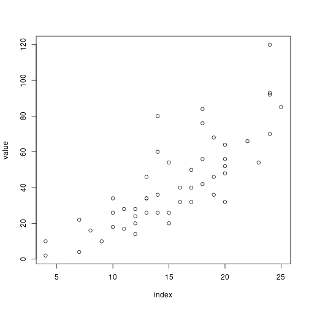

[](https://travis-ci.org/arendsee/rmonad)
[](https://codecov.io/github/arendsee/rmonad?branch=master)

<!-- README.md is generated from README.Rmd. Please edit that file -->


# `rmonad`

Chain monadic sequences into stateful, branching pipelines.

You may use `rmonad` to

 * build linear pipelines, as with `magrittr`

 * access results at any step within the pipeline

 * access results preceding an error

 * handle errors naturally

 * call effects -- e.g. plotting, caching -- within a pipeline

 * branch or merge pipelines, while preserving their history

 * annotate nodes in the graph

 * benchmark a pipeline to find bottleknecks in time and space 


## Installation

You can install rmonad from github with:


```r
# install.packages("devtools")
devtools::install_github("arendsee/rmonad")
```

## Examples

For details, see the vignette. Here are a few excerpts


```r
library(rmonad)
```


### Record history and access inner values


```r
1:5      %>>%
    sqrt %v>% # record an intermediate value
    sqrt %>>%
    sqrt
#> R> 1:5
#> R> sqrt
#> [1] 1.000000 1.414214 1.732051 2.000000 2.236068
#> 
#> R> sqrt
#> R> sqrt
#> 
#>  ----------------- 
#> 
#> [1] 1.000000 1.090508 1.147203 1.189207 1.222845
```


### Add effects inside a pipeline


```r
# Both plots and summarizes an input table
cars %>_% plot(xlab="index", ylab="value") %>>% summary
```



```
#> R> cars
#> R> plot(xlab = "index", ylab = "value")
#> R> summary
#> 
#>  ----------------- 
#> 
#>      speed           dist       
#>  Min.   : 4.0   Min.   :  2.00  
#>  1st Qu.:12.0   1st Qu.: 26.00  
#>  Median :15.0   Median : 36.00  
#>  Mean   :15.4   Mean   : 42.98  
#>  3rd Qu.:19.0   3rd Qu.: 56.00  
#>  Max.   :25.0   Max.   :120.00
```


### Use first successful result


```r
x <- list()

# return first value in a list, otherwise return NULL
if(length(x) > 0) {
    x[[1]]
} else {
    NULL
}
#> NULL

# this does the same
x[[1]] %||% NULL %>% esc
#> NULL
```


### Independent evaluation of multiple expressions


```r
lsmeval(
    runif(5),
    stop("stop, drop and die"),
    runif("df"),
    1:10
)
#> [[1]]
#> R> runif(5)
#> 
#> [[1]]
#> R> stop("stop, drop and die")
#>  * ERROR: stop, drop and die
#> 
#> [[1]]
#> R> runif("df")
#>  * ERROR: invalid arguments
#>  * WARNING: NAs introduced by coercion
#> 
#> [[1]]
#> R> 1:10
#> 
#> R> lsmeval(runif(5), stop("stop, drop and die"), runif("df"), 1:10)
#> 
#>  ----------------- 
#> 
#> [[1]]
#> [1] 0.5120101 0.8351271 0.8930770 0.4460601 0.2983039
#> 
#> [[2]]
#> NULL
#> 
#> [[3]]
#> NULL
#> 
#> [[4]]
#>  [1]  1  2  3  4  5  6  7  8  9 10
#> 
#>  *** FAILURE ***
```


### Build branching pipelines


```r
lsmeval(
    read.csv("a.csv") %>>% do_analysis_a,
    read.csv("b.csv") %>>% do_analysis_b,
    k = 5
) %*>% joint_analysis
```


### Chain independent pipelines, with documentation


```r
runif(10)  %>>% abs %>% doc(

    "Alternatively, the documentation could go into a text block below the code
in a knitr document. The advantage of having documentation here, is that it is
coupled unambiguously to the generating function. This is a monadic
interpretation of literate programming. These annotations, together with the
ability to chain chains of monads, allows whole complex workflows to be built,
with the results collated into a single monad. All errors propagate exactly as
errors should, only affecting downstream computations. The final monad can be
converted into a markdown document. A graph of functions can automatically be
built. Summaries of the locations of errors. The monad could be extended for
automated benchmarking."

                  ) %>^% sum %^__%
rnorm("a") %>>% abs %>^% sum %^__%
rexp(10)   %>>% abs %>^% sum %>%
    mtabulate
#> Error in (function (..., deparse.level = 1, make.row.names = TRUE, stringsAsFactors = default.stringsAsFactors()) : invalid list argument: all variables should have the same length
```
