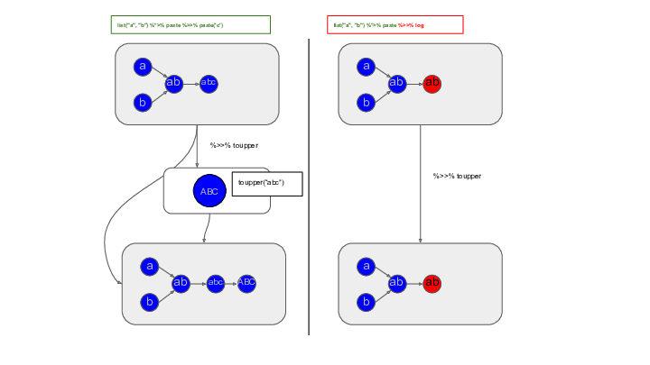
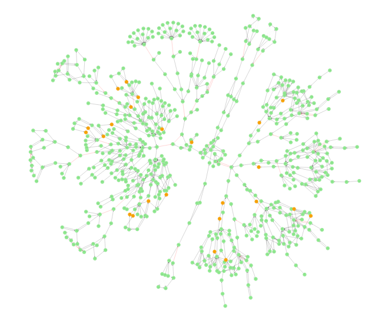

# Introduction

`rmonad` is an R package designed to reduce the tedium of pipeline development
and maintainance.

The `rmonad` package provides a set of tools to chain monadic sequences into
stateful, branching pipelines. As nodes in the pipeline are run, they are
merged into a graph of all past operations. The resulting structure can be
computed on to access not only the final results, but also node documentation,
intermediate data, performance stats, and any raised messages, warnings or
errors. `rmonad` intercepts all exceptions, which allows for pure error
handling.

# Pipeline programming in R

R is superably suited for pipeline programming. The `magrittr` and `pipeR`
packages offer infix operators for chaining function application with very
little overhead [@magrittr2014, @pipeR2016]. The output of the left-hand side
function is passed as the first argument to the right-hand function. Since the
first argument of most R functions is the main data input, the functions can be
chained as neatly as in familiar Bash pipelines.

The fundamental difference between `rmonad` and `magrittr` (or `pipeR`) is that
`rmonad` passes state between nodes of the pipeline.  

The output of an `rmonad` pipeline is an `igraph` object [@igraph] that stores
the relationships between all nodes in the pipeline. In the case of an error,
`rmonad` provies a traceback with the inputs to each failing function stored.
This allows the pipeline to be debugged without rerunning it.

Overall, the goal is to wrap within this one object everything that is need to
produce a report on the pipeline. `rmonad` does not generate reports, but it
can work very nicely as an input to tools that do, such the literate
programming package `knitr` [@knitr] or the HTML report generator `Nozzle.R1`
[@gehlenborg2013nozzle].

# Related work

`rmonad` is at a deep level related to the "Make" family of programs, for
example the original GNU Make [@stallman2002gnu] and the R package `drake`
[@drake]. Like Make, `rmonad` builds a graph of dependent operations. 

# Why we need a monadic pipeline program in R

error/warning/log message
capture, and ).  While magrittr provides pipe-based
pipelines, R provides documentation and debugging of those pipelines. 

Monad reference: [@wadler1995monads]

When building pipelines, especially flexible and scalable pipelines, the main
challenge is to maintain clarity in design and maintenance. A pipeline tool
that keeps track of branching provides standard ways to think of pipelines and
more efficient pipeline design. 

# Approach

`rmonad` is inspired from-Haskell style monads (see fig), but formal rigor has
been sacrificed for convenience. It should be considered more, monadish, than
monadic.

# Features

 | feature         | description |
 | --------------- | ----------- |
 | branching       | ...         |
 | conditionals    | ...         |
 | error recovery  | ...         |
 | documentation   | ...         |
 | print capture   | ...         |
 | code capture    | ...         |
 | benchmarking    | ...         |
 | caching         | ...         |
 | post-processing | ...         |
 | summarization   | ...         |
 | metadata        | ...         |

 * branching (many simple pipeline programs are linear)

(This provides the main challenge for documenting pipelines. Many existing
simple pipeline programs are linear. By providing a tool that enables debugging
branched pipelines, we can encourage more complex and efficient pipeline
development.)

 * documentation

(both in documentation of the intermediate and final results as well as intermediate log/warning/error messages)

 * error, warning, message capture

Functions may print messags -- log messages, warning messages, or error
messages -- which should be stored in the same node that stores the code and
value.  Usually in R, when running a big pipeline, it is difficult to tell what
code produced what message since messages are sent to STDOUT. 

In addition, since STDOUT history is finite, developers can very easily lose
the messages.  For example, one function may be processing several sequences
and dump thousands of lines of warnings: one warning for each bad gene.  This
may easily be lost int he STDOUT but will be captured as strings in rmonad. 

Capturing the messages as strings has the added benefit, that the developer can
add a warning reformatter to the rmonad node, reducing this to one warning
listing the number of bad genes.  Then the developer can create a succinct
issue report. Each issue is associated with a node in the Rmonad output object.
So the developer can find the code and, if stored, the input values, to that
function.

 * code capture

each code block is associated with a node, (couldn't we do a string match of
the code block to the whole code base to get line number for missues? -- Except
we often don't have the whole code base. The R code my be copied in line by
line, with interspersed irrelevant lines. Now, this could be possible if the
user explicitly provided a source.)

 * benchmarking

`rmonad` automatically captures runtime and memory usage of each node.

 * traceback with stored inputs
 
(walk through a traceback. Long pipeline, an error at step X, go back and fix X)

 * post-processing functions: summarize

 * report generation

(issue report as well as final presentation report. Report generation important, it provides wow factor and many companies sell reports.)

 * metadata

(How is this different from code capture, log/warning/error message capture? Maybe this is the input dependency information? Generally the term "metadata" is very vague...)

The metadata in a node is literally an arbitrary list associated with a node.
This allows anything you want (such as version info) to be stuck in a node. It
can be used in report generation, like the parameters in `knitr` chunks. It can
also be used to store extra annotations or notes after a pipeline has been run.

# Approach

 | operator | description                                                                     |
 | -------- | ------------------------------------------------------------------------------- |
 | `%>>%`   | pass left hand side (lhs) as initial argument of right hand side (rhs) function |
 | `%v>%`   | like `%>>%` but stores lhs value                                                |
 | `%>_%`   | like `%>>%` but passes lhs instead of rhs -- propagates rhs failure             |
 | `%>^%`   | like `%>_%` but does not propagate rhs failure, branch operator                 |
 | `%||%`   | use rhs value if lhs is failing                                                 |
 | `%|>%`   | call rhs on lhs if lhs failed                                                   |
 | `%*>%`   | treat lhs as list of arguments passed to the rhs function                       |
 | `%__%`   | ignore lhs, rhs starts a new chain (but preserves lhs history)                  |

    Include graph of pipelines here. (green = good; orange = warnings; red = errors)
    Point out some errors that are caught by this graph. Point out some design 
    decisions to make the pipeline more efficient inspired by looking at the graph. 
    Spell out why this graph is important.

# Conclusions

We have presented a method to incorporate monadic pipelines into R using the
rmonad tool. This paper was motivated by the desire to publish best practices
in pipelines in R and to encourage better pipeline design and maintenance. 

A conspicuosly absent feature is automatic parallelism and cluster submission
handling. These may be added in the future, but currently the goal of `rmonad`
is to handle complexity, not volume.

    leave it open in the discussion as future directions, or point out how rmonad 
    would be ideal for parallelism, unlike other pipeline documentation tools which 
    are linear

# Funding

This material is based upon work supported by the National Science Foundation
under Grant No. IOS 1546858.

This research was supported in part by an appointment to the Agricultural
Research Service (ARS) Research Participation Program administered by the Oak
Ridge Institute for Science and Education (ORISE) through an interagency
agreement between the U.S. Department of Energy (DOE) and the U.S. Department
of Agriculture (USDA). ORISE is managed by ORAU under DOE contract number
DE-SC0014664. All opinions expressed in this paper are the author's and do not
necessarily reflect the policies and views of USDA, ARS, DOE, or ORAU/ORISE. 

# References
