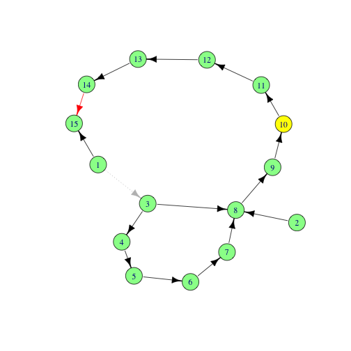
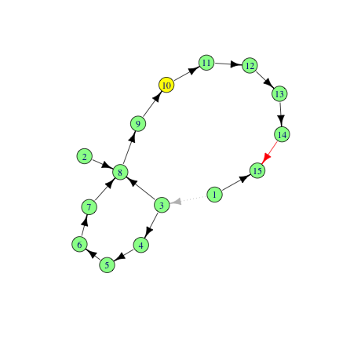

This work is funded by the National Science Foundation grant [NSF-IOS
1546858](https://www.nsf.gov/awardsearch/showAward?AWD_ID=1546858).


## The problem

Gene Feature Format (GFF) is used to annotate intervals on a genome. Loading
and validating a GFF is a common first step in a bioinformatics analysis.
Mistakes at this step can cause major problems later, so it is important to
validate the GFF and report good diagnostics when problems arise. Here I will
show how such a pipeline can be written using standard methods, and then show
how `rmonad` can be used to organize and annotate such a pipeline.

GFF files are TAB-delimited where each row corresponds to a single interval.
These intervals, though, may be ontologically related. For example a gene is
the parent of an mRNA, which in turn is a parent of a set of exons and a set of
coding sequences (CDS). These relations are specified in the attribute column
(column 9). Here is an example (with TABs replaced with space) that introduces
the main format and the variants we need to support: 

```
# this is a comment, they can appear anywhere in the GFF
# also note, empty lines can appear anywhere in the file

# This is a simple mono-exonic gene
I   .   gene   11565   11951   .   -   .   ID=gene0
I   .   mRNA   11565   11951   .   -   .   ID=mrna0;Parent=gene0
I   .   exon   11565   11951   .   -   .   Parent=mrna0
I   .   CDS    11565   11951   .   -   0   Parent=mrna0

# this is a gene with two splicing variants:
I   .   gene   61931   83591   .   +   .   ID=gene1

I   .   mRNA   61931   83591   .   +   .   ID=rna1;Parent=gene1
I   .   exon   61931   62344   .   +   .   Parent=rna1
I   .   exon   81616   82209   .   +   .   Parent=rna1
I   .   exon   82211   83591   .   +   .   Parent=rna1
I   .   CDS   61931   62344   .   +   0   Parent=rna1
I   .   CDS   81616   82209   .   +   0   Parent=rna1
I   .   CDS   82211   82681   .   +   0   Parent=rna1

I   .   mRNA   61931   83591   .   +   .   ID=rna2;Parent=gene1
I   .   exon   61931   62344   .   +   .   Parent=rna2
I   .   exon   81616   82209   .   +   .   Parent=rna2
I   .   exon   82211   83591   .   +   .   Parent=rna2
I   .   CDS   61931   62344   .   +   0   Parent=rna2
I   .   CDS   82211   82681   .   +   0   Parent=rna2

# Below are a few variants that occur (unforunately) in the wild

# V1: CDS directly descending from a gene.
b   .   gene   7235   9016   .   -   .   ID=gene2
b   .   CDS    7235   9016   .   -   0   Parent=gene2

# V2: 'Parent=-' when feature has no parent
I   .   gene   11565   11951   .   -   .   ID=gene3;Parent=-

# V3: Elements with no tags that need to be treated as IDs
I   .   gene   11565   11951   .   -   .   gene3
I   .   mRNA   11565   11951   .   -   .   ID=mrna3;Parent=gene3
I   .   exon   11565   11951   .   -   .   Parent=mrna3
I   .   CDS    11565   11951   .   -   0   Parent=mrna3
```

Another issues we need to account for is type synonyms. The feature type
(column 3) is required to be valid Sequence Ontology (SO) terms. For the
purposes of this vignette, I will just handle the following sets of synonyms:

 * gene := `gene` | `SO:0000704`

 * mRNA := `mRNA` | `messenger RNA` | `messenger_RNA` | `SO:0000234`
            | `transcript` | `SO:0000673`

 * CDS  := `CDS` | `coding_sequence` | `coding sequence` | `SO:0000316`

 * exon := `exon` | `SO:0000147` | `coding_exon` | `coding exon` |`SO:0000195` 

For mRNA and exon, I am merging to ontology terms (mRNA and transcript; exon
and coding exon). Formally, this is incorrect, but pratically it is probably
the right thing. Since these transformations may be wrong, they need to be
noted.

## Solution

To test our solution, I use the `gff` rmonad dataset.

### Conventional approach

Before using `rmonad`, I will use a more conventional approach.


```r
library(readr)
library(dplyr)
```

```
## 
## Attaching package: 'dplyr'
```

```
## The following objects are masked from 'package:stats':
## 
##     filter, lag
```

```
## The following objects are masked from 'package:base':
## 
##     intersect, setdiff, setequal, union
```

```r
library(tidyr)
```

```
## 
## Attaching package: 'tidyr'
```

```
## The following object is masked from 'package:magrittr':
## 
##     extract
```

```r
library(magrittr)
set.seed(210)

good_gfffile <- system.file('extdata', 'gff', '0.gff3', package='rmonad')

read_gff <- function(file){
  readr::read_tsv(
    file,
    col_names = c(
        "seqid",
        "source",
        "type",
        "start",
        "stop",
        "score",
        "strand",
        "phase",
        "attr"
    ),
    na        = ".",
    comment   = "#",
    col_types = "ccciidcic"
  )
}

read_gff(good_gfffile)
```

```
## # A tibble: 17 x 9
##    seqid source type                  start   stop score strand phase attr                 
##    <chr> <chr>  <chr>                 <int>  <int> <dbl> <chr>  <int> <chr>                
##  1 a     Strex  region                    1 230218    NA +         NA ID=I                 
##  2 a     Strex  telomere                  1    801    NA -         NA ID=id1               
##  3 a     Strex  origin_of_replication   707    776    NA +         NA ID=id2               
##  4 a     Strex  gene                   1807   2169    NA -         NA ID=gene1             
##  5 a     Strex  mRNA                   1807   2169    NA -         NA ID=mrna1;Parent=gene1
##  6 a     Strex  exon                   1807   2169    NA -         NA Parent=mrna1         
##  7 a     Strex  CDS                    1807   2169    NA -          0 Parent=mrna1         
##  8 a     Strex  mRNA                   2480   2707    NA +         NA ID=mrna2;Parent=gene1
##  9 a     Strex  exon                   2480   2707    NA +         NA Parent=mrna2         
## 10 a     Strex  CDS                    2480   2707    NA +          0 Parent=mrna2         
## 11 b     Strex  gene                   7235   9016    NA -         NA ID=gene2             
## 12 b     Strex  CDS                    7235   9016    NA -          0 Parent=gene2         
## 13 b     Strex  origin_of_replication  7997   8547    NA +         NA ID=id6               
## 14 b     Strex  gene                  11565  11951    NA -         NA ID=gene3             
## 15 b     Strex  mRNA                  11565  11951    NA -         NA ID=mrna3;Parent=gene3
## 16 b     Strex  exon                  11565  11951    NA -         NA Parent=mrna3         
## 17 b     Strex  CDS                   11565  11951    NA -          0 Parent=mrna3
```

This is a nice start, also, `readr` will pick up on any deviations from the
specified column number and type, warning of problems:


```r
# wrong type
bad0 <- system.file('extdata', 'gff', 'bad-0.gff3', package='rmonad')
bad_result0 <- read_gff(bad0)
```

```
## Warning: 1 parsing failure.
## row   col   expected                               actual                                                              file
##   4 start an integer one thousand eight hundred and seven '/Users/zebulun.arendsee/R/library/rmonad/extdata/gff/bad-0.gff3'
```

```r
bad_result0
```

```
## # A tibble: 17 x 9
##    seqid source type                  start   stop score strand phase attr                 
##    <chr> <chr>  <chr>                 <int>  <int> <dbl> <chr>  <int> <chr>                
##  1 a     Strex  region                    1 230218    NA +         NA ID=I                 
##  2 a     Strex  telomere                  1    801    NA -         NA ID=id1               
##  3 a     Strex  origin_of_replication   707    776    NA +         NA ID=id2               
##  4 a     Strex  gene                     NA   2169    NA -         NA ID=gene1             
##  5 a     Strex  mRNA                   1807   2169    NA -         NA ID=mrna1;Parent=gene1
##  6 a     Strex  exon                   1807   2169    NA -         NA Parent=mrna1         
##  7 a     Strex  CDS                    1807   2169    NA -          0 Parent=mrna1         
##  8 a     Strex  mRNA                   2480   2707    NA +         NA ID=mrna2;Parent=gene1
##  9 a     Strex  exon                   2480   2707    NA +         NA Parent=mrna2         
## 10 a     Strex  CDS                    2480   2707    NA +          0 Parent=mrna2         
## 11 b     Strex  gene                   7235   9016    NA -         NA ID=gene2             
## 12 b     Strex  CDS                    7235   9016    NA -          0 Parent=gene2         
## 13 b     Strex  origin_of_replication  7997   8547    NA +         NA ID=id6               
## 14 b     Strex  gene                  11565  11951    NA -         NA ID=gene3             
## 15 b     Strex  mRNA                  11565  11951    NA -         NA ID=mrna3;Parent=gene3
## 16 b     Strex  exon                  11565  11951    NA -         NA Parent=mrna3         
## 17 b     Strex  CDS                   11565  11951    NA -          0 Parent=mrna3
```

Notice that the 4th entry has a start value of "NA". This indicates there was something wrong with he gff file and when we take a look at the original gff, we see that the entry corresponds to the string "one thousand eight hundred and seven" instead of the number. While this is not a likely error, it is a similar error for when a number contains a comma (example: "1,807"") which R will parse as a string.

```{,eval=FALSE}
# incorrect type
a       Strex   region  1       230218  .       +       .       ID=I
a       Strex   telomere        1       801     .       -       .       ID=id1
a       Strex   origin_of_replication   707     776     .       +       .       ID=id2
a       Strex   gene    "one thousand eight hundred and seven"  2169    .       -       .       ID=gene1
```

Similarly when we load in a gff missing a column.

```r
# wrong column number
bad1 <- system.file('extdata', 'gff', 'bad-1.gff3', package='rmonad')
bad_result1 <- read_gff(bad1)
```

```
## Warning: 51 parsing failures.
## row   col   expected    actual                                                              file
##   1 score a double   +         '/Users/zebulun.arendsee/R/library/rmonad/extdata/gff/bad-1.gff3'
##   1 phase an integer ID=I      '/Users/zebulun.arendsee/R/library/rmonad/extdata/gff/bad-1.gff3'
##   1 NA    9 columns  8 columns '/Users/zebulun.arendsee/R/library/rmonad/extdata/gff/bad-1.gff3'
##   2 score a double   -         '/Users/zebulun.arendsee/R/library/rmonad/extdata/gff/bad-1.gff3'
##   2 phase an integer ID=id1    '/Users/zebulun.arendsee/R/library/rmonad/extdata/gff/bad-1.gff3'
## ... ..... .......... ......... .................................................................
## See problems(...) for more details.
```

```r
bad_result1
```

```
## # A tibble: 17 x 9
##    seqid source                type   start  stop score strand phase attr 
##    <chr> <chr>                 <chr>  <int> <int> <dbl> <chr>  <int> <chr>
##  1 a     region                1     230218    NA    NA <NA>      NA <NA> 
##  2 a     telomere              1        801    NA    NA <NA>      NA <NA> 
##  3 a     origin_of_replication 707      776    NA    NA <NA>      NA <NA> 
##  4 a     gene                  1807    2169    NA    NA <NA>      NA <NA> 
##  5 a     mRNA                  1807    2169    NA    NA <NA>      NA <NA> 
##  6 a     exon                  1807    2169    NA    NA <NA>      NA <NA> 
##  7 a     CDS                   1807    2169    NA    NA 0         NA <NA> 
##  8 a     mRNA                  2480    2707    NA    NA <NA>      NA <NA> 
##  9 a     exon                  2480    2707    NA    NA <NA>      NA <NA> 
## 10 a     CDS                   2480    2707    NA    NA 0         NA <NA> 
## 11 b     gene                  7235    9016    NA    NA <NA>      NA <NA> 
## 12 b     CDS                   7235    9016    NA    NA 0         NA <NA> 
## 13 b     origin_of_replication 7997    8547    NA    NA <NA>      NA <NA> 
## 14 b     gene                  11565  11951    NA    NA <NA>      NA <NA> 
## 15 b     mRNA                  11565  11951    NA    NA <NA>      NA <NA> 
## 16 b     exon                  11565  11951    NA    NA <NA>      NA <NA> 
## 17 b     CDS                   11565  11951    NA    NA 0         NA <NA>
```
The read_gff can correctly identify that a column is missing from the following raw file.
```{,eval=FALSE}
# missing one column
a       region  1       230218  .       +       .       ID=I
a       telomere        1       801     .       -       .       ID=id1
a       origin_of_replication   707     776     .       +       .       ID=id2
a       gene    1807    2169    .       -       .       ID=gene1
```

R uses `NA` to indicate missing values. The R 'numeric' type corresponds to
Haskell `[Maybe Num]`, i.e. an array of possibly empty values. In a GFF,
columns 2,6,7,8 and 9 may be missing, the others may not. So we need an
additional assertion that these are complete.


```r
g <- read_gff(good_gfffile)
for(col in c("seqid", "type", "start", "stop")){
  if(any(is.na(g[[col]]))){
    stop("GFFError: Column '", col, "' may not have missing values")
  }
}
```

Now we can account for type synonyms using the following method


```r
gene_synonyms <- 'SO:0000704'
mRNA_synonyms <- c('messenger_RNA', 'messenger RNA', 'SO:0000234')
CDS_synonyms  <- c('coding_sequence', 'coding sequence', 'SO:0000316')
exon_synonyms <- 'SO:0000147'

g$type <- ifelse(g$type %in% gene_synonyms, 'gene', g$type)
g$type <- ifelse(g$type %in% mRNA_synonyms, 'mRNA', g$type)
g$type <- ifelse(g$type %in% CDS_synonyms,  'CDS',  g$type)
g$type <- ifelse(g$type %in% exon_synonyms, 'exon', g$type)

mRNA_near_synonyms <- c('transcript', 'SO:0000673')
exon_near_synonyms <- c('SO:0000147', 'coding_exon', 'coding exon', 'SO:0000195')

if(any(g$type %in% mRNA_near_synonyms)){
    g$type <- ifelse(g$type %in% mRNA_near_synonyms, 'mRNA', g$type)
    warning("Substituting transcript types for mRNA types, this is probably OK")
}

if(any(g$type %in% exon_near_synonyms)){
    g$type <- ifelse(g$type %in% exon_near_synonyms, 'exon', g$type)
    warning("Substituting transcript types for exon types, this is probably OK")
}
```

Now we need to evaluate the attribute column.


```r
tags <- c("ID", "Parent")

data_frame(
    attr  = stringr::str_split(g$attr, ";"),
    order = 1:nrow(g)
  ) %>%
  dplyr::mutate(ntags = sapply(attr, length)) %>%
  tidyr::unnest(attr) %>%
  dplyr::mutate(attr = ifelse(grepl('=', attr), attr, paste(".U", attr, sep="="))) %>%
  tidyr::separate_(
    col   = "attr",
    into  = c("tag", "value"),
    sep   = "=",
    extra = "merge"
  ) %>%
  dplyr::filter(tag %in% c(tags, ".U")) %>%
  {
    if(nrow(.) > 0){
      tidyr::spread(., key="tag", value="value")
    } else {
      .$tag   = NULL
      .$value = NULL
      .
    }
  } %>%
  {
    if("Parent" %in% names(.)){
      .$Parent <- ifelse(.$Parent == "-", NA, .$Parent)
    }
    .
  } %>% {
    for(tag in c(tags, ".U")){
      if(! tag %in% names(.))
        .[[tag]] = NA_character_
    }
    .
  } %>%
  {
    if("ID" %in% names(.))
      .$ID <- ifelse(is.na(.$ID) & !is.na(.$.U) & .$ntags == 1, .$.U, .$ID)
    .
  } %>%
  merge(data_frame(order=1:nrow(g)), all=TRUE) %>%
  dplyr::arrange(order) %>%
  { cbind(g, .) } %>%
  dplyr::select(-.U, -order, -ntags, -attr) %>%
  {
    if(all(c("ID", "Parent") %in% names(.))){
      parents <- subset(., type %in% c("CDS", "exon"))$Parent
      parent_types <- subset(., ID %in% parents)$type

      if(any(parent_types == "gene"))
        warning("Found CDS or exon directly inheriting from a gene, this may be fine.") 

      if(! all(parent_types %in% c("gene", "mRNA")))
        stop("Found CDS or exon with illegal parent")

      if( any(is.na(parents)) )
        stop("Found CDS or exon with no parent")

      if(! any(duplicated(.$ID, incomparables=NA)))
        warning("IDs are not unique, this is probably bad")
    }
    .
  }
```

```
## Warning: `data_frame()` is deprecated, use `tibble()`.
## This warning is displayed once per session.
```

```
## Warning in function_list[[k]](value): Found CDS or exon directly inheriting from a gene, this may be fine.
```

```
## Warning in function_list[[k]](value): IDs are not unique, this is probably bad
```

```
##    seqid source                  type start   stop score strand phase    ID Parent
## 1      a  Strex                region     1 230218    NA      +    NA     I   <NA>
## 2      a  Strex              telomere     1    801    NA      -    NA   id1   <NA>
## 3      a  Strex origin_of_replication   707    776    NA      +    NA   id2   <NA>
## 4      a  Strex                  gene  1807   2169    NA      -    NA gene1   <NA>
## 5      a  Strex                  mRNA  1807   2169    NA      -    NA mrna1  gene1
## 6      a  Strex                  exon  1807   2169    NA      -    NA  <NA>  mrna1
## 7      a  Strex                   CDS  1807   2169    NA      -     0  <NA>  mrna1
## 8      a  Strex                  mRNA  2480   2707    NA      +    NA mrna2  gene1
## 9      a  Strex                  exon  2480   2707    NA      +    NA  <NA>  mrna2
## 10     a  Strex                   CDS  2480   2707    NA      +     0  <NA>  mrna2
## 11     b  Strex                  gene  7235   9016    NA      -    NA gene2   <NA>
## 12     b  Strex                   CDS  7235   9016    NA      -     0  <NA>  gene2
## 13     b  Strex origin_of_replication  7997   8547    NA      +    NA   id6   <NA>
## 14     b  Strex                  gene 11565  11951    NA      -    NA gene3   <NA>
## 15     b  Strex                  mRNA 11565  11951    NA      -    NA mrna3  gene3
## 16     b  Strex                  exon 11565  11951    NA      -    NA  <NA>  mrna3
## 17     b  Strex                   CDS 11565  11951    NA      -     0  <NA>  mrna3
```

The beauty of this chain is that it requires few temporary variables (just `g`,
and `tags`), it is a pure flow of data. It is an elegant sequence of functions
operating on a single thread of data.

But there are a few problems.

First, it is in dire need of documentation. We could add in comments. But
comments cannot be formatted well. A better approach is some form of literate
programming, such as rewriting the program in Rmarkdown. But this 1) breaks the
pipeline (since we can't pipe between chunks), 2) results in an object we can't
compute on, 3) makes debugging even more difficult, because our code is spread
out. 

### `rmonad` approach

With `rmonad` we can mingle documentation and code in a computable object.


```r
require(readr)
require(dplyr)
require(tidyr)
require(magrittr)
library(rmonad)
```

```
## 
## Attaching package: 'rmonad'
```

```
## The following object is masked from 'package:dplyr':
## 
##     combine
```

```r
set.seed(210)

#' @param file The input GFF file
#' @param tags The GFF tags to keep
#'        default these are not stored)
read_gff <- function(file, tags){

  "
  This function reads a GFF. It builds a data frame from it that with a column
  for each value in `tags`.

  The `read_gff` function is a nested function, containing an Rmonad pipeline
  inside it. This docstring describes the entire wrapped pipeline.
  "

  raw_gff <- as_monad(
    {

      "
      Rmonad supports docstrings. If a block begins with a string, this
      string is extracted and stored. Python has something similar, where the
      first string in a function is cast as documentation.
      
      The `as_monad` function takes an expression and wraps its result into a
      context. It also handles the extraction of this docstring. The result
      here is used at more than one place in the pipeline. Rather than
      accessing it later as a global, it will be funneled bach in.
      "

      readr::read_tsv(
        file,
        col_names = c(
          "seqid",
          "source",
          "type",
          "start",
          "stop",
          "score",
          "strand",
          "phase",
          "attr"
        ),
        na        = ".",
        comment   = "#",
        col_types = "ccciidcic"
      )
    }
  )

  raw_gff %>% tag('raw_gff') %>>% {

    "
    The %>>% operator applies the function described in this block to the
    input on the left-hand-side. This corresponds to the UNIX '|' or magrittr's
    '%>%'. It differs from them in that it is a monadic bind operator, rather
    than an application operator. It carries a context along with the
    computations. The context can store past values, performance information,
    this docstring, and links to the parent chunk. The context is a directed
    graph of code chunks and their metadata.

    Here I assert that no data is missing in the columns where it is required.
    "

    for(col in c("seqid", "type", "start", "stop")){
      if(any(is.na(.[[col]]))){
        stop("GFFError: Column '", col, "' may not have missing values")
      }
    }
    .
  } %>>% {

    "
    According the GFF specification, the value in the type column should be
    from the Sequence Ontology (SO). Here I collapse the synonymous terms
    for the main features usually present in GFF file (gene, mRNA, CDS, and
    exon). In production code, I would probably do something a bit more formal. 
    "

    gene_synonyms <- 'SO:0000704'
    mRNA_synonyms <- c('messenger_RNA', 'messenger RNA', 'SO:0000234')
    CDS_synonyms  <- c('coding_sequence', 'coding sequence', 'SO:0000316')
    exon_synonyms <- 'SO:0000147'

    .$type <- ifelse(.$type %in% gene_synonyms, 'gene', .$type)
    .$type <- ifelse(.$type %in% mRNA_synonyms, 'mRNA', .$type)
    .$type <- ifelse(.$type %in% CDS_synonyms,  'CDS',  .$type)
    .$type <- ifelse(.$type %in% exon_synonyms, 'exon', .$type)

    .
  } %>_% {

    "
    The %>_% operator lets this chunk of code be run for its effects, which are
    raising warnings if we replace the type with a questionable synonym.  We
    could alternatively just use %>>% and add a terminal '.' to this chunk.
    However, the `%>_%` operator guarantees the input is passed without being
    changed, which is safer and also clarifies our intention. 
    "

    mRNA_near_synonyms <- c('transcript', 'SO:0000673')
    exon_near_synonyms <- c('SO:0000147', 'coding_exon', 'coding exon', 'SO:0000195')

    if(any(.$type %in% mRNA_near_synonyms)){
        .$type <- ifelse(.$type %in% mRNA_near_synonyms, 'mRNA', .$type)
        warning("Substituting transcript types for mRNA types, this is probably OK")
    }

    if(any(.$type %in% exon_near_synonyms)){
        .$type <- ifelse(.$type %in% exon_near_synonyms, 'exon', .$type)
        warning("Substituting transcript types for exon types, this is probably OK")
    }

  } %>>% {

    "
    Notice below that I use the magrittr operator '%>%' inside the rmonad
    pipeline. When to pipe with rmonad and when to pipe with magrittr is a
    matter of granularity. This chunk of code perhaps should form one
    documentation unit. And perhaps I don't expect it to fail. If I break this
    chunk into several, the failures are more localized, and I can access
    intermediate values for debugging. On the other hand, putting every little
    operation in a new chunk will clutter the graph and reports derived from
    it.
    "

    data_frame(
      attr  = stringr::str_split(.$attr, ";"),
      order = 1:nrow(.)
    ) %>%
      dplyr::mutate(ntags = sapply(attr, length)) %>%
      tidyr::unnest(attr) %>%
      dplyr::mutate(attr = ifelse(grepl('=', attr), attr, paste(".U", attr, sep="="))) %>%
      tidyr::separate_(
        col   = "attr",
        into  = c("tag", "value"),
        sep   = "=",
        extra = "merge"
      )

   } %>% funnel(raw_gff=raw_gff, tags=tags) %*>% {

    "
    The %v>% operator stores the input value in memory. We could replace every
    %>>% operator with %v>%. This would let us inspect every step of an
    analysis at the cost of high memory usage. For brevity, I won't break this
    following block down any further.

    The `funnel` function packages a list in a monad, merging their histories
    and propagating error. That is, if `gff` or `tags` failed upstream, this
    function will not be run. `%*>%` takes a list on the left and feeds it into
    the function on the right as an argument list. Here `funnel` and `%*>%` are
    used together to merge a pipeline (gff) and inject a parameter (tags).

    We could not have written

      %v>% function(gff=gff, tags=tags)

    because this would have brought the monad wrapped gff into scope, not the
    value itself.
    "

      dplyr::filter(., tag %in% c(tags, ".U")) %>%
      {
        if(nrow(.) > 0){
          tidyr::spread(., key="tag", value="value")
        } else {
          .$tag   = NULL
          .$value = NULL
          .
        }
      } %>%
      {
        if("Parent" %in% names(.)){
          .$Parent <- ifelse(.$Parent == "-", NA, .$Parent)
        }
        .
      } %>% {
        for(tag in c(tags, ".U")){
          if(! tag %in% names(.))
            .[[tag]] = NA_character_
        }
        .
      } %>%
      {
        if("ID" %in% names(.))
          .$ID <- ifelse(is.na(.$ID) & !is.na(.$.U) & .$ntags == 1, .$.U, .$ID)
        .
      } %>%
      merge(data_frame(order=1:nrow(raw_gff)), all=TRUE) %>%
      dplyr::arrange(order) %>%
      { cbind(raw_gff, .) } %>%
      dplyr::select(-.U, -order, -ntags, -attr)

  } %>_% {

    "
    And make the last few assertions.
    "

    if(all(c("ID", "Parent") %in% names(.))){
      parents <- subset(., type %in% c("CDS", "exon"))$Parent
      parent_types <- subset(., ID %in% parents)$type

      if(any(parent_types == "gene"))
        warning("Found CDS or exon directly inheriting from a gene, this may be fine.")

      if(! all(parent_types %in% c("gene", "mRNA")))
        stop("Found CDS or exon with illegal parent")

      if(any(is.na(parents)) )
        stop("Found CDS or exon with no parent")

      if(any(duplicated(.$ID, incomparables=NA)))
        warning("IDs are not unique, this is probably bad")
    }

  } %>_% {

    "
    I could post some closing comments here. The %>_% operator can be chained
    and the output does not affect the output of the main chain. The NULL is
    required to distinguish this block from an anonymous function that returns
    a string.
    "

    NULL
  }
  # End Rmonad chain

}

gff_as_graph <- function(file){
  read_gff(file, tags=c("ID", "Parent")) %>>%
  dplyr::filter(!is.na(Parent)) %>>%
  {
      "Make a unique label for each CDS and exon interval"
      dplyr::group_by(., Parent) %>%
      dplyr::mutate(ID = ifelse(type %in% c("CDS", "exon"),
                                paste(type, start, sep='-'),
                                ID)) %>%
      dplyr::ungroup()
  } %>>% {
    "Make a graph of gene models"
    dplyr::select(., ID, Parent) %>%
      as.matrix %>%
      igraph::graph_from_edgelist()
  }
}
```

That is the whole GFF program in an rmonad framework


```r
result <-
  system.file('extdata', 'gff', '0.gff3', package='rmonad') %v>% gff_as_graph
result %>% plot
```



`esc` will extract the final result, and raise all errors, warnings and
messages that where extracted


```r
esc(result)
```

```
## Warning: in 'function (.) 
## {
##     if (all(c("ID", "Parent") %in% names(.))) {
##         parents <- subset(., type %in% c("CDS", "exon"))$Parent
##         parent_types <- subset(., ID %in% parents)$type
##         if (any(parent_types == "gene")) 
##             warning("Found CDS or exon directly inheriting from a gene, this may be fine.")
##         if (!all(parent_types %in% c("gene", "mRNA"))) 
##             stop("Found CDS or exon with illegal parent")
##         if (any(is.na(parents))) 
##             stop("Found CDS or exon with no parent")
##         if (any(duplicated(.$ID, incomparables = NA))) 
##             warning("IDs are not unique, this is probably bad")
##     }
## }': Found CDS or exon directly inheriting from a gene, this may be fine.
```

```
## IGRAPH 02a45ab DN-- 13 10 -- 
## + attr: name (v/c)
## + edges from 02a45ab (vertex names):
##  [1] mrna1     ->gene1 exon-1807 ->mrna1 CDS-1807  ->mrna1 mrna2     ->gene1 exon-2480 ->mrna2 CDS-2480  ->mrna2 CDS-7235  ->gene2 mrna3     ->gene3
##  [9] exon-11565->mrna3 CDS-11565 ->mrna3
```

Now we see why we might want a little more granularity in our pipeline. To
summarize the results we can use the `mtabulate` functions.


```r
mtabulate(result)
```

```
##    id   OK cached  time space is_nested ndependents nnotes nwarnings error doc
## 1   1 TRUE   TRUE 0.001   168         0           1      0         0     0   0
## 2   2 TRUE  FALSE 0.001   176         0           1      0         0     0   0
## 3   3 TRUE   TRUE 0.001 10288         0           2      0         0     0   1
## 4   4 TRUE  FALSE 0.001 10288         0           1      0         0     0   1
## 5   5 TRUE  FALSE 0.001 10288         0           1      0         0     0   1
## 6   6 TRUE  FALSE 0.001 10288         0           1      0         0     0   1
## 7   7 TRUE  FALSE 0.001  2472         0           1      0         0     0   1
## 8   8 TRUE  FALSE 0.001 13376         0           1      0         0     0   0
## 9   9 TRUE  FALSE 0.001  4840         0           1      0         0     0   1
## 10 10 TRUE  FALSE 0.001  4840         0           1      0         1     0   1
## 11 11 TRUE  FALSE 0.001  4840         0           1      0         0     0   1
## 12 12 TRUE  FALSE 0.001  3896         0           1      0         0     0   0
## 13 13 TRUE  FALSE 0.001  4480         0           1      0         0     0   1
## 14 14 TRUE  FALSE 0.001  3280         0           0      0         0     0   1
## 15 15 TRUE   TRUE 0.001  3280         1           0      0         0     0   0
```

We can also get a summary of issues


```r
missues(result)
```

```
##   id    type                                                                issue
## 1 10 warning Found CDS or exon directly inheriting from a gene, this may be fine.
```

The `id` column corresponds to a row number in the `mtabulate` result.

To extract particular values, we can use the `get_*` family of vectorized
getters


```r
# get a list of every stored value, report uncached values as NULL
get_value(result, warn=FALSE)
# get a list of every docstring
get_doc(result)
```


```r
plot(result)
```



A plot of the connections between functions in the pipeline. The node labels
are the `rmonad` ids. The red arrow indicates a 'nest' relationship. Green nodes
are OK, orange nodes raised a warning, red nodes (none appear in this graph)
represent errors.

If the pipeline fails, the last valid result is saved, for example


```r
m <-
  system.file('extdata', 'gff', '15.gff3', package='rmonad') %v>%
  gff_as_graph
```

To diagnose the problem, we might first read the error messages:


```r
get_error(m)
```

```
## [[1]]
## character(0)
## 
## [[2]]
## character(0)
## 
## [[3]]
## character(0)
## 
## [[4]]
## [1] "GFFError: Column 'type' may not have missing values"
## 
## [[5]]
## character(0)
## 
## [[6]]
## character(0)
```

Here we see the 4th node raised an error: we having missing values in the
'type' column.

To get a big picture of the pipeline:


```r
mtabulate(m)
```

```
##   id    OK cached  time space is_nested ndependents nnotes nwarnings error doc
## 1  1  TRUE   TRUE 0.001   168         0           1      0         0     0   0
## 2  2  TRUE  FALSE 0.001   176         0           1      0         0     0   0
## 3  3  TRUE   TRUE 0.001 17016         0           2      0         1     0   1
## 4  4 FALSE   TRUE 0.001 17016         0           1      0         0     1   1
## 5  5 FALSE   TRUE 0.001 17632         0           0      0         0     0   1
## 6  6 FALSE   TRUE 0.001   168         1           0      0         0     0   0
```

The the last three nodes are in the failing state (see column 'OK'). We can see
all issues:


```r
missues(m)
```

```
##   id    type
## 1  4   error
## 2  3 warning
##                                                                                                                                                                                                                                                                                                                                                                                                                                                                                                                                                                                                                                                                                                                             issue
## 1                                                                                                                                                                                                                                                                                                                                                                                                                                                                                                                                                                                                                                                                             GFFError: Column 'type' may not have missing values
## 2 41 parsing failures.\nrow col  expected    actual                                                           file\n 13  -- 9 columns 1 columns '/Users/zebulun.arendsee/R/library/rmonad/extdata/gff/15.gff3'\n 14  -- 9 columns 1 columns '/Users/zebulun.arendsee/R/library/rmonad/extdata/gff/15.gff3'\n 15  -- 9 columns 1 columns '/Users/zebulun.arendsee/R/library/rmonad/extdata/gff/15.gff3'\n 16  -- 9 columns 1 columns '/Users/zebulun.arendsee/R/library/rmonad/extdata/gff/15.gff3'\n 17  -- 9 columns 1 columns '/Users/zebulun.arendsee/R/library/rmonad/extdata/gff/15.gff3'\n... ... ......... ......... ..............................................................\nSee problems(...) for more details.\n
```

We see two warnings in node 3. To see what code is wrapped in node 3:


```r
get_code(m, 3)
```

```
## [[1]]
## [1] "{"                                                                         
## [2] "    readr::read_tsv(file, col_names = c(\"seqid\", \"source\", \"type\", " 
## [3] "        \"start\", \"stop\", \"score\", \"strand\", \"phase\", \"attr\"), "
## [4] "        na = \".\", comment = \"#\", col_types = \"ccciidcic\")"           
## [5] "}"
```

So there were issues in reading the file. We can get the value of this node's parent:


```r
get_value(m, get_parents(m, 3)[[1]])[[1]]
```

```
## [1] "/Users/zebulun.arendsee/R/library/rmonad/extdata/gff/15.gff3"
```

If we wanted to explore the raw data, we could jump into a Bash shell, navigate
to the file above, and take it apart with UNIX tools (the lines of raw data
were not stored in the Rmonad object).

We might next check out the failing columns:


```r
get_code(m, 4:6)
```

```
## [[1]]
## [1] "function (.) "                                                                   
## [2] "{"                                                                               
## [3] "    for (col in c(\"seqid\", \"type\", \"start\", \"stop\")) {"                  
## [4] "        if (any(is.na(.[[col]]))) {"                                             
## [5] "            stop(\"GFFError: Column '\", col, \"' may not have missing values\")"
## [6] "        }"                                                                       
## [7] "    }"                                                                           
## [8] "    ."                                                                           
## [9] "}"                                                                               
## 
## [[2]]
## [1] "funnel(., raw_gff = raw_gff, tags = tags)"
## 
## [[3]]
## [1] "gff_as_graph"
```

Now that we know exactly _where_ the problem is, we can start working through
the data that triggered the problem:


```r
get_value(m, get_parents(m, 5)[[1]])
```

```
## Warning in v@get(warn): Attempting to access data that has been deleted, returning 'NULL'
```

```
## [[1]]
## NULL
## 
## [[2]]
## # A tibble: 53 x 9
##    seqid                                              source type            start  stop     score strand phase
##    <chr>                                              <chr>  <chr>           <int> <int>     <dbl> <chr>  <int>
##  1 ctg123                                             <NA>   gene              100   900 NA        +         NA
##  2 ctg123                                             <NA>   TF_binding_site   110   121 NA        +         NA
##  3 ctg123                                             <NA>   mRNA              205   900 NA        +         NA
##  4 ctg123                                             <NA>   five_prime_UTR    205   220 NA        +         NA
##  5 ctg123                                             <NA>   CDS               221   350 NA        +          0
##  6 ctg123                                             <NA>   CDS               400   444 NA        +          0
##  7 ctg123                                             <NA>   CDS               500   550 NA        +          0
##  8 ctg123                                             <NA>   CDS               700   760 NA        +          0
##  9 ctg123                                             <NA>   three_prime_UTR   761   900 NA        +         NA
## 10 ctg123                                             <NA>   cDNA_match        105   150  5.80e-42 +         NA
## 11 ctg123                                             <NA>   cDNA_match        500   550  8.10e-43 +         NA
## 12 ctg123                                             <NA>   cDNA_match        700   900  1.40e-40 +         NA
## 13 >ctg123                                            <NA>   <NA>               NA    NA NA        <NA>      NA
## 14 cttctgggcgtacccgattctcggagaacttgccgcaccattccgccttg <NA>   <NA>               NA    NA NA        <NA>      NA
## 15 tgttcattgctgcctgcatgttcattgtctacctcggctacgtgtggcta <NA>   <NA>               NA    NA NA        <NA>      NA
## 16 tctttcctcggtgccctcgtgcacggagtcgagaaaccaaagaacaaaaa <NA>   <NA>               NA    NA NA        <NA>      NA
## 17 aagaaattaaaatatttattttgctgtggtttttgatgtgtgttttttat <NA>   <NA>               NA    NA NA        <NA>      NA
## 18 aatgatttttgatgtgaccaattgtacttttcctttaaatgaaatgtaat <NA>   <NA>               NA    NA NA        <NA>      NA
## 19 cttaaatgtatttccgacgaattcgaggcctgaaaagtgtgacgccattc <NA>   <NA>               NA    NA NA        <NA>      NA
## 20 gtatttgatttgggtttactatcgaataatgagaattttcaggcttaggc <NA>   <NA>               NA    NA NA        <NA>      NA
## 21 ttaggcttaggcttaggcttaggcttaggcttaggcttaggcttaggctt <NA>   <NA>               NA    NA NA        <NA>      NA
## 22 aggcttaggcttaggcttaggcttaggcttaggcttaggcttaggcttag <NA>   <NA>               NA    NA NA        <NA>      NA
## 23 aatctagctagctatccgaaattcgaggcctgaaaagtgtgacgccattc <NA>   <NA>               NA    NA NA        <NA>      NA
## 24 cttctgggcgtacccgattctcggagaacttgccgcaccattccgccttg <NA>   <NA>               NA    NA NA        <NA>      NA
## 25 tgttcattgctgcctgcatgttcattgtctacctcggctacgtgtggcta <NA>   <NA>               NA    NA NA        <NA>      NA
## 26 tctttcctcggtgccctcgtgcacggagtcgagaaaccaaagaacaaaaa <NA>   <NA>               NA    NA NA        <NA>      NA
## 27 aagaaattaaaatatttattttgctgtggtttttgatgtgtgttttttat <NA>   <NA>               NA    NA NA        <NA>      NA
## 28 aatgatttttgatgtgaccaattgtacttttcctttaaatgaaatgtaat <NA>   <NA>               NA    NA NA        <NA>      NA
## 29 cttaaatgtatttccgacgaattcgaggcctgaaaagtgtgacgccattc <NA>   <NA>               NA    NA NA        <NA>      NA
## 30 gtatttgatttgggtttactatcgaataatgagaattttcaggcttaggc <NA>   <NA>               NA    NA NA        <NA>      NA
## 31 ttaggcttaggcttaggcttaggcttaggcttaggcttaggcttaggctt <NA>   <NA>               NA    NA NA        <NA>      NA
## 32 aggcttaggcttaggcttaggcttaggcttaggcttaggcttaggcttag <NA>   <NA>               NA    NA NA        <NA>      NA
## 33 aatctagctagctatccgaaattcgaggcctgaaaagtgtgacgccattc <NA>   <NA>               NA    NA NA        <NA>      NA
## 34 >cdna0123                                          <NA>   <NA>               NA    NA NA        <NA>      NA
## 35 ttcaagtgctcagtcaatgtgattcacagtatgtcaccaaatattttggc <NA>   <NA>               NA    NA NA        <NA>      NA
## 36 agctttctcaagggatcaaaattatggatcattatggaatacctcggtgg <NA>   <NA>               NA    NA NA        <NA>      NA
## 37 aggctcagcgctcgatttaactaaaagtggaaagctggacgaaagtcata <NA>   <NA>               NA    NA NA        <NA>      NA
## 38 tcgctgtgattcttcgcgaaattttgaaaggtctcgagtatctgcatagt <NA>   <NA>               NA    NA NA        <NA>      NA
## 39 gaaagaaaaatccacagagatattaaaggagccaacgttttgttggaccg <NA>   <NA>               NA    NA NA        <NA>      NA
## 40 tcaaacagcggctgtaaaaatttgtgattatggttaaaggtgttggaccg <NA>   <NA>               NA    NA NA        <NA>      NA
## 41 ttcaagtgctcagtcaatgtgattcacagtatgtcaccaaatattttggc <NA>   <NA>               NA    NA NA        <NA>      NA
## 42 agctttctcaagggatcaaaattatggatcattatggaatacctcggtgg <NA>   <NA>               NA    NA NA        <NA>      NA
## 43 aggctcagcgctcgatttaactaaaagtggaaagctggacgaaagtcata <NA>   <NA>               NA    NA NA        <NA>      NA
## 44 tcgctgtgattcttcgcgaaattttgaaaggtctcgagtatctgcatagt <NA>   <NA>               NA    NA NA        <NA>      NA
## 45 gaaagaaaaatccacagagatattaaaggagccaacgttttgttggaccg <NA>   <NA>               NA    NA NA        <NA>      NA
## 46 tcaaacagcggctgtaaaaatttgtgattatggttaaaggtgttggaccg <NA>   <NA>               NA    NA NA        <NA>      NA
## 47 ttcaagtgctcagtcaatgtgattcacagtatgtcaccaaatattttggc <NA>   <NA>               NA    NA NA        <NA>      NA
## 48 agctttctcaagggatcaaaattatggatcattatggaatacctcggtgg <NA>   <NA>               NA    NA NA        <NA>      NA
## 49 aggctcagcgctcgatttaactaaaagtggaaagctggacgaaagtcata <NA>   <NA>               NA    NA NA        <NA>      NA
## 50 tcgctgtgattcttcgcgaaattttgaaaggtctcgagtatctgcatagt <NA>   <NA>               NA    NA NA        <NA>      NA
## 51 gaaagaaaaatccacagagatattaaaggagccaacgttttgttggaccg <NA>   <NA>               NA    NA NA        <NA>      NA
## 52 tcaaacagcggctgtaaaaatttgtgattatggttaaaggtgttggaccg <NA>   <NA>               NA    NA NA        <NA>      NA
## 53 tcaaacagcggctgtaaaaatttgtgattatggttaaaggtgttggaccg <NA>   <NA>               NA    NA NA        <NA>      NA
##    attr                                     
##    <chr>                                    
##  1 ID=gene00001;Name=EDEN                   
##  2 ID=tfbs00001;Parent=gene00001            
##  3 ID=mRNA00001;Parent=gene00001;Name=EDEN.1
##  4 Parent=mRNA00001                         
##  5 ID=cds00001;Parent=mRNA00001             
##  6 ID=cds00001;Parent=mRNA00001             
##  7 ID=cds00001;Parent=mRNA00001             
##  8 ID=cds00001;Parent=mRNA00001             
##  9 Parent=mRNA00001                         
## 10 ID=match00001;Target=cdna0123+12+462     
## 11 ID=match00001;Target=cdna0123+463+963    
## 12 ID=match00001;Target=cdna0123+964+2964   
## 13 <NA>                                     
## 14 <NA>                                     
## 15 <NA>                                     
## 16 <NA>                                     
## 17 <NA>                                     
## 18 <NA>                                     
## 19 <NA>                                     
## 20 <NA>                                     
## 21 <NA>                                     
## 22 <NA>                                     
## 23 <NA>                                     
## 24 <NA>                                     
## 25 <NA>                                     
## 26 <NA>                                     
## 27 <NA>                                     
## 28 <NA>                                     
## 29 <NA>                                     
## 30 <NA>                                     
## 31 <NA>                                     
## 32 <NA>                                     
## 33 <NA>                                     
## 34 <NA>                                     
## 35 <NA>                                     
## 36 <NA>                                     
## 37 <NA>                                     
## 38 <NA>                                     
## 39 <NA>                                     
## 40 <NA>                                     
## 41 <NA>                                     
## 42 <NA>                                     
## 43 <NA>                                     
## 44 <NA>                                     
## 45 <NA>                                     
## 46 <NA>                                     
## 47 <NA>                                     
## 48 <NA>                                     
## 49 <NA>                                     
## 50 <NA>                                     
## 51 <NA>                                     
## 52 <NA>                                     
## 53 <NA>                                     
## 
## [[3]]
## # A tibble: 53 x 9
##    seqid                                              source type            start  stop     score strand phase
##    <chr>                                              <chr>  <chr>           <int> <int>     <dbl> <chr>  <int>
##  1 ctg123                                             <NA>   gene              100   900 NA        +         NA
##  2 ctg123                                             <NA>   TF_binding_site   110   121 NA        +         NA
##  3 ctg123                                             <NA>   mRNA              205   900 NA        +         NA
##  4 ctg123                                             <NA>   five_prime_UTR    205   220 NA        +         NA
##  5 ctg123                                             <NA>   CDS               221   350 NA        +          0
##  6 ctg123                                             <NA>   CDS               400   444 NA        +          0
##  7 ctg123                                             <NA>   CDS               500   550 NA        +          0
##  8 ctg123                                             <NA>   CDS               700   760 NA        +          0
##  9 ctg123                                             <NA>   three_prime_UTR   761   900 NA        +         NA
## 10 ctg123                                             <NA>   cDNA_match        105   150  5.80e-42 +         NA
## 11 ctg123                                             <NA>   cDNA_match        500   550  8.10e-43 +         NA
## 12 ctg123                                             <NA>   cDNA_match        700   900  1.40e-40 +         NA
## 13 >ctg123                                            <NA>   <NA>               NA    NA NA        <NA>      NA
## 14 cttctgggcgtacccgattctcggagaacttgccgcaccattccgccttg <NA>   <NA>               NA    NA NA        <NA>      NA
## 15 tgttcattgctgcctgcatgttcattgtctacctcggctacgtgtggcta <NA>   <NA>               NA    NA NA        <NA>      NA
## 16 tctttcctcggtgccctcgtgcacggagtcgagaaaccaaagaacaaaaa <NA>   <NA>               NA    NA NA        <NA>      NA
## 17 aagaaattaaaatatttattttgctgtggtttttgatgtgtgttttttat <NA>   <NA>               NA    NA NA        <NA>      NA
## 18 aatgatttttgatgtgaccaattgtacttttcctttaaatgaaatgtaat <NA>   <NA>               NA    NA NA        <NA>      NA
## 19 cttaaatgtatttccgacgaattcgaggcctgaaaagtgtgacgccattc <NA>   <NA>               NA    NA NA        <NA>      NA
## 20 gtatttgatttgggtttactatcgaataatgagaattttcaggcttaggc <NA>   <NA>               NA    NA NA        <NA>      NA
## 21 ttaggcttaggcttaggcttaggcttaggcttaggcttaggcttaggctt <NA>   <NA>               NA    NA NA        <NA>      NA
## 22 aggcttaggcttaggcttaggcttaggcttaggcttaggcttaggcttag <NA>   <NA>               NA    NA NA        <NA>      NA
## 23 aatctagctagctatccgaaattcgaggcctgaaaagtgtgacgccattc <NA>   <NA>               NA    NA NA        <NA>      NA
## 24 cttctgggcgtacccgattctcggagaacttgccgcaccattccgccttg <NA>   <NA>               NA    NA NA        <NA>      NA
## 25 tgttcattgctgcctgcatgttcattgtctacctcggctacgtgtggcta <NA>   <NA>               NA    NA NA        <NA>      NA
## 26 tctttcctcggtgccctcgtgcacggagtcgagaaaccaaagaacaaaaa <NA>   <NA>               NA    NA NA        <NA>      NA
## 27 aagaaattaaaatatttattttgctgtggtttttgatgtgtgttttttat <NA>   <NA>               NA    NA NA        <NA>      NA
## 28 aatgatttttgatgtgaccaattgtacttttcctttaaatgaaatgtaat <NA>   <NA>               NA    NA NA        <NA>      NA
## 29 cttaaatgtatttccgacgaattcgaggcctgaaaagtgtgacgccattc <NA>   <NA>               NA    NA NA        <NA>      NA
## 30 gtatttgatttgggtttactatcgaataatgagaattttcaggcttaggc <NA>   <NA>               NA    NA NA        <NA>      NA
## 31 ttaggcttaggcttaggcttaggcttaggcttaggcttaggcttaggctt <NA>   <NA>               NA    NA NA        <NA>      NA
## 32 aggcttaggcttaggcttaggcttaggcttaggcttaggcttaggcttag <NA>   <NA>               NA    NA NA        <NA>      NA
## 33 aatctagctagctatccgaaattcgaggcctgaaaagtgtgacgccattc <NA>   <NA>               NA    NA NA        <NA>      NA
## 34 >cdna0123                                          <NA>   <NA>               NA    NA NA        <NA>      NA
## 35 ttcaagtgctcagtcaatgtgattcacagtatgtcaccaaatattttggc <NA>   <NA>               NA    NA NA        <NA>      NA
## 36 agctttctcaagggatcaaaattatggatcattatggaatacctcggtgg <NA>   <NA>               NA    NA NA        <NA>      NA
## 37 aggctcagcgctcgatttaactaaaagtggaaagctggacgaaagtcata <NA>   <NA>               NA    NA NA        <NA>      NA
## 38 tcgctgtgattcttcgcgaaattttgaaaggtctcgagtatctgcatagt <NA>   <NA>               NA    NA NA        <NA>      NA
## 39 gaaagaaaaatccacagagatattaaaggagccaacgttttgttggaccg <NA>   <NA>               NA    NA NA        <NA>      NA
## 40 tcaaacagcggctgtaaaaatttgtgattatggttaaaggtgttggaccg <NA>   <NA>               NA    NA NA        <NA>      NA
## 41 ttcaagtgctcagtcaatgtgattcacagtatgtcaccaaatattttggc <NA>   <NA>               NA    NA NA        <NA>      NA
## 42 agctttctcaagggatcaaaattatggatcattatggaatacctcggtgg <NA>   <NA>               NA    NA NA        <NA>      NA
## 43 aggctcagcgctcgatttaactaaaagtggaaagctggacgaaagtcata <NA>   <NA>               NA    NA NA        <NA>      NA
## 44 tcgctgtgattcttcgcgaaattttgaaaggtctcgagtatctgcatagt <NA>   <NA>               NA    NA NA        <NA>      NA
## 45 gaaagaaaaatccacagagatattaaaggagccaacgttttgttggaccg <NA>   <NA>               NA    NA NA        <NA>      NA
## 46 tcaaacagcggctgtaaaaatttgtgattatggttaaaggtgttggaccg <NA>   <NA>               NA    NA NA        <NA>      NA
## 47 ttcaagtgctcagtcaatgtgattcacagtatgtcaccaaatattttggc <NA>   <NA>               NA    NA NA        <NA>      NA
## 48 agctttctcaagggatcaaaattatggatcattatggaatacctcggtgg <NA>   <NA>               NA    NA NA        <NA>      NA
## 49 aggctcagcgctcgatttaactaaaagtggaaagctggacgaaagtcata <NA>   <NA>               NA    NA NA        <NA>      NA
## 50 tcgctgtgattcttcgcgaaattttgaaaggtctcgagtatctgcatagt <NA>   <NA>               NA    NA NA        <NA>      NA
## 51 gaaagaaaaatccacagagatattaaaggagccaacgttttgttggaccg <NA>   <NA>               NA    NA NA        <NA>      NA
## 52 tcaaacagcggctgtaaaaatttgtgattatggttaaaggtgttggaccg <NA>   <NA>               NA    NA NA        <NA>      NA
## 53 tcaaacagcggctgtaaaaatttgtgattatggttaaaggtgttggaccg <NA>   <NA>               NA    NA NA        <NA>      NA
##    attr                                     
##    <chr>                                    
##  1 ID=gene00001;Name=EDEN                   
##  2 ID=tfbs00001;Parent=gene00001            
##  3 ID=mRNA00001;Parent=gene00001;Name=EDEN.1
##  4 Parent=mRNA00001                         
##  5 ID=cds00001;Parent=mRNA00001             
##  6 ID=cds00001;Parent=mRNA00001             
##  7 ID=cds00001;Parent=mRNA00001             
##  8 ID=cds00001;Parent=mRNA00001             
##  9 Parent=mRNA00001                         
## 10 ID=match00001;Target=cdna0123+12+462     
## 11 ID=match00001;Target=cdna0123+463+963    
## 12 ID=match00001;Target=cdna0123+964+2964   
## 13 <NA>                                     
## 14 <NA>                                     
## 15 <NA>                                     
## 16 <NA>                                     
## 17 <NA>                                     
## 18 <NA>                                     
## 19 <NA>                                     
## 20 <NA>                                     
## 21 <NA>                                     
## 22 <NA>                                     
## 23 <NA>                                     
## 24 <NA>                                     
## 25 <NA>                                     
## 26 <NA>                                     
## 27 <NA>                                     
## 28 <NA>                                     
## 29 <NA>                                     
## 30 <NA>                                     
## 31 <NA>                                     
## 32 <NA>                                     
## 33 <NA>                                     
## 34 <NA>                                     
## 35 <NA>                                     
## 36 <NA>                                     
## 37 <NA>                                     
## 38 <NA>                                     
## 39 <NA>                                     
## 40 <NA>                                     
## 41 <NA>                                     
## 42 <NA>                                     
## 43 <NA>                                     
## 44 <NA>                                     
## 45 <NA>                                     
## 46 <NA>                                     
## 47 <NA>                                     
## 48 <NA>                                     
## 49 <NA>                                     
## 50 <NA>                                     
## 51 <NA>                                     
## 52 <NA>                                     
## 53 <NA>
```

```r
get_value(m, 5)[[1]]
```

```
## [[1]]
## NULL
## 
## $raw_gff
## # A tibble: 53 x 9
##    seqid                                              source type            start  stop     score strand phase
##    <chr>                                              <chr>  <chr>           <int> <int>     <dbl> <chr>  <int>
##  1 ctg123                                             <NA>   gene              100   900 NA        +         NA
##  2 ctg123                                             <NA>   TF_binding_site   110   121 NA        +         NA
##  3 ctg123                                             <NA>   mRNA              205   900 NA        +         NA
##  4 ctg123                                             <NA>   five_prime_UTR    205   220 NA        +         NA
##  5 ctg123                                             <NA>   CDS               221   350 NA        +          0
##  6 ctg123                                             <NA>   CDS               400   444 NA        +          0
##  7 ctg123                                             <NA>   CDS               500   550 NA        +          0
##  8 ctg123                                             <NA>   CDS               700   760 NA        +          0
##  9 ctg123                                             <NA>   three_prime_UTR   761   900 NA        +         NA
## 10 ctg123                                             <NA>   cDNA_match        105   150  5.80e-42 +         NA
## 11 ctg123                                             <NA>   cDNA_match        500   550  8.10e-43 +         NA
## 12 ctg123                                             <NA>   cDNA_match        700   900  1.40e-40 +         NA
## 13 >ctg123                                            <NA>   <NA>               NA    NA NA        <NA>      NA
## 14 cttctgggcgtacccgattctcggagaacttgccgcaccattccgccttg <NA>   <NA>               NA    NA NA        <NA>      NA
## 15 tgttcattgctgcctgcatgttcattgtctacctcggctacgtgtggcta <NA>   <NA>               NA    NA NA        <NA>      NA
## 16 tctttcctcggtgccctcgtgcacggagtcgagaaaccaaagaacaaaaa <NA>   <NA>               NA    NA NA        <NA>      NA
## 17 aagaaattaaaatatttattttgctgtggtttttgatgtgtgttttttat <NA>   <NA>               NA    NA NA        <NA>      NA
## 18 aatgatttttgatgtgaccaattgtacttttcctttaaatgaaatgtaat <NA>   <NA>               NA    NA NA        <NA>      NA
## 19 cttaaatgtatttccgacgaattcgaggcctgaaaagtgtgacgccattc <NA>   <NA>               NA    NA NA        <NA>      NA
## 20 gtatttgatttgggtttactatcgaataatgagaattttcaggcttaggc <NA>   <NA>               NA    NA NA        <NA>      NA
## 21 ttaggcttaggcttaggcttaggcttaggcttaggcttaggcttaggctt <NA>   <NA>               NA    NA NA        <NA>      NA
## 22 aggcttaggcttaggcttaggcttaggcttaggcttaggcttaggcttag <NA>   <NA>               NA    NA NA        <NA>      NA
## 23 aatctagctagctatccgaaattcgaggcctgaaaagtgtgacgccattc <NA>   <NA>               NA    NA NA        <NA>      NA
## 24 cttctgggcgtacccgattctcggagaacttgccgcaccattccgccttg <NA>   <NA>               NA    NA NA        <NA>      NA
## 25 tgttcattgctgcctgcatgttcattgtctacctcggctacgtgtggcta <NA>   <NA>               NA    NA NA        <NA>      NA
## 26 tctttcctcggtgccctcgtgcacggagtcgagaaaccaaagaacaaaaa <NA>   <NA>               NA    NA NA        <NA>      NA
## 27 aagaaattaaaatatttattttgctgtggtttttgatgtgtgttttttat <NA>   <NA>               NA    NA NA        <NA>      NA
## 28 aatgatttttgatgtgaccaattgtacttttcctttaaatgaaatgtaat <NA>   <NA>               NA    NA NA        <NA>      NA
## 29 cttaaatgtatttccgacgaattcgaggcctgaaaagtgtgacgccattc <NA>   <NA>               NA    NA NA        <NA>      NA
## 30 gtatttgatttgggtttactatcgaataatgagaattttcaggcttaggc <NA>   <NA>               NA    NA NA        <NA>      NA
## 31 ttaggcttaggcttaggcttaggcttaggcttaggcttaggcttaggctt <NA>   <NA>               NA    NA NA        <NA>      NA
## 32 aggcttaggcttaggcttaggcttaggcttaggcttaggcttaggcttag <NA>   <NA>               NA    NA NA        <NA>      NA
## 33 aatctagctagctatccgaaattcgaggcctgaaaagtgtgacgccattc <NA>   <NA>               NA    NA NA        <NA>      NA
## 34 >cdna0123                                          <NA>   <NA>               NA    NA NA        <NA>      NA
## 35 ttcaagtgctcagtcaatgtgattcacagtatgtcaccaaatattttggc <NA>   <NA>               NA    NA NA        <NA>      NA
## 36 agctttctcaagggatcaaaattatggatcattatggaatacctcggtgg <NA>   <NA>               NA    NA NA        <NA>      NA
## 37 aggctcagcgctcgatttaactaaaagtggaaagctggacgaaagtcata <NA>   <NA>               NA    NA NA        <NA>      NA
## 38 tcgctgtgattcttcgcgaaattttgaaaggtctcgagtatctgcatagt <NA>   <NA>               NA    NA NA        <NA>      NA
## 39 gaaagaaaaatccacagagatattaaaggagccaacgttttgttggaccg <NA>   <NA>               NA    NA NA        <NA>      NA
## 40 tcaaacagcggctgtaaaaatttgtgattatggttaaaggtgttggaccg <NA>   <NA>               NA    NA NA        <NA>      NA
## 41 ttcaagtgctcagtcaatgtgattcacagtatgtcaccaaatattttggc <NA>   <NA>               NA    NA NA        <NA>      NA
## 42 agctttctcaagggatcaaaattatggatcattatggaatacctcggtgg <NA>   <NA>               NA    NA NA        <NA>      NA
## 43 aggctcagcgctcgatttaactaaaagtggaaagctggacgaaagtcata <NA>   <NA>               NA    NA NA        <NA>      NA
## 44 tcgctgtgattcttcgcgaaattttgaaaggtctcgagtatctgcatagt <NA>   <NA>               NA    NA NA        <NA>      NA
## 45 gaaagaaaaatccacagagatattaaaggagccaacgttttgttggaccg <NA>   <NA>               NA    NA NA        <NA>      NA
## 46 tcaaacagcggctgtaaaaatttgtgattatggttaaaggtgttggaccg <NA>   <NA>               NA    NA NA        <NA>      NA
## 47 ttcaagtgctcagtcaatgtgattcacagtatgtcaccaaatattttggc <NA>   <NA>               NA    NA NA        <NA>      NA
## 48 agctttctcaagggatcaaaattatggatcattatggaatacctcggtgg <NA>   <NA>               NA    NA NA        <NA>      NA
## 49 aggctcagcgctcgatttaactaaaagtggaaagctggacgaaagtcata <NA>   <NA>               NA    NA NA        <NA>      NA
## 50 tcgctgtgattcttcgcgaaattttgaaaggtctcgagtatctgcatagt <NA>   <NA>               NA    NA NA        <NA>      NA
## 51 gaaagaaaaatccacagagatattaaaggagccaacgttttgttggaccg <NA>   <NA>               NA    NA NA        <NA>      NA
## 52 tcaaacagcggctgtaaaaatttgtgattatggttaaaggtgttggaccg <NA>   <NA>               NA    NA NA        <NA>      NA
## 53 tcaaacagcggctgtaaaaatttgtgattatggttaaaggtgttggaccg <NA>   <NA>               NA    NA NA        <NA>      NA
##    attr                                     
##    <chr>                                    
##  1 ID=gene00001;Name=EDEN                   
##  2 ID=tfbs00001;Parent=gene00001            
##  3 ID=mRNA00001;Parent=gene00001;Name=EDEN.1
##  4 Parent=mRNA00001                         
##  5 ID=cds00001;Parent=mRNA00001             
##  6 ID=cds00001;Parent=mRNA00001             
##  7 ID=cds00001;Parent=mRNA00001             
##  8 ID=cds00001;Parent=mRNA00001             
##  9 Parent=mRNA00001                         
## 10 ID=match00001;Target=cdna0123+12+462     
## 11 ID=match00001;Target=cdna0123+463+963    
## 12 ID=match00001;Target=cdna0123+964+2964   
## 13 <NA>                                     
## 14 <NA>                                     
## 15 <NA>                                     
## 16 <NA>                                     
## 17 <NA>                                     
## 18 <NA>                                     
## 19 <NA>                                     
## 20 <NA>                                     
## 21 <NA>                                     
## 22 <NA>                                     
## 23 <NA>                                     
## 24 <NA>                                     
## 25 <NA>                                     
## 26 <NA>                                     
## 27 <NA>                                     
## 28 <NA>                                     
## 29 <NA>                                     
## 30 <NA>                                     
## 31 <NA>                                     
## 32 <NA>                                     
## 33 <NA>                                     
## 34 <NA>                                     
## 35 <NA>                                     
## 36 <NA>                                     
## 37 <NA>                                     
## 38 <NA>                                     
## 39 <NA>                                     
## 40 <NA>                                     
## 41 <NA>                                     
## 42 <NA>                                     
## 43 <NA>                                     
## 44 <NA>                                     
## 45 <NA>                                     
## 46 <NA>                                     
## 47 <NA>                                     
## 48 <NA>                                     
## 49 <NA>                                     
## 50 <NA>                                     
## 51 <NA>                                     
## 52 <NA>                                     
## 53 <NA>                                     
## 
## $tags
## [1] "ID"     "Parent"
```


From this it looks like there is raw sequence data contained in the GFF file.
According to the GFF specification, it is legal to have the full sequence data
appended to the tabular GFF data. So we probably should either add a test that
will raise an appropriate error message or extend our function to handle this
case.

`rmonad` saved the input to the failing function. This makes debugging much
simpler. We did not have to disassemble our pipeline and rerun it step-by-step.

Overall, in `rmonad`, the output of a pipeline is not just the effluent of the
last node, but the collection of all the nodes along the way. The pipeline
itself becomes data that can be computed upon. 


